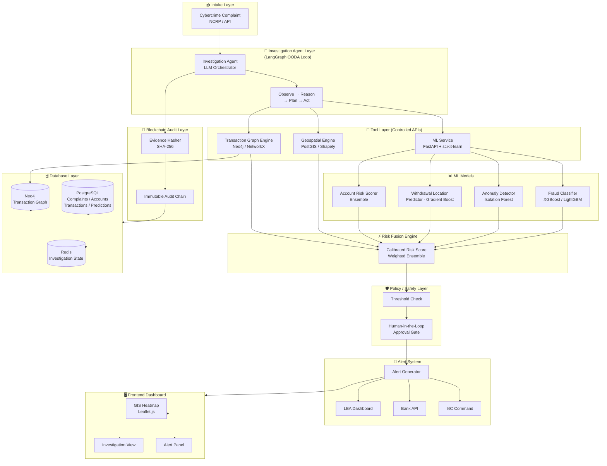
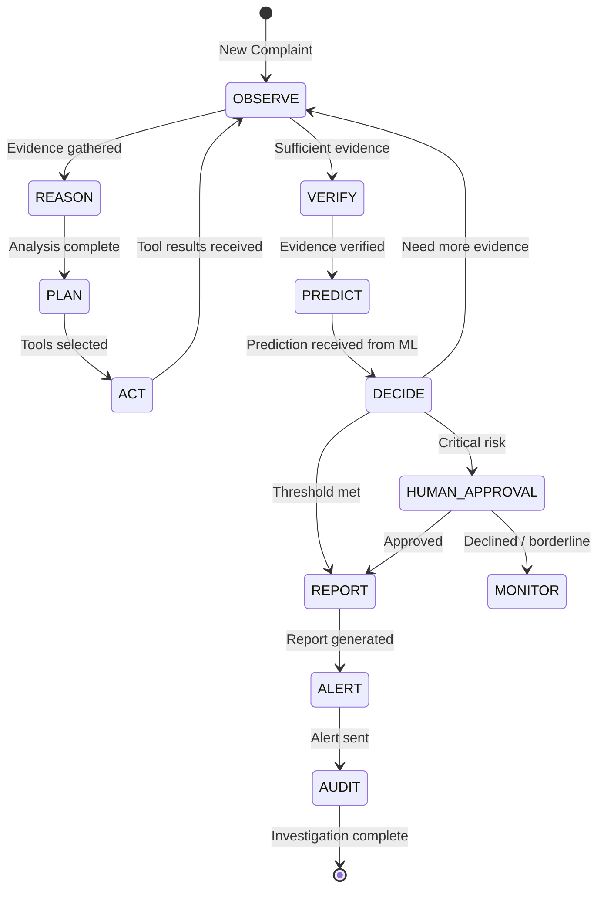
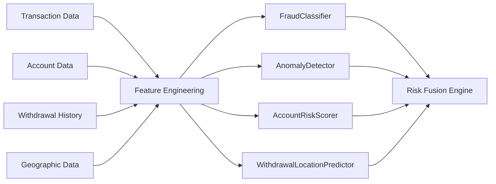
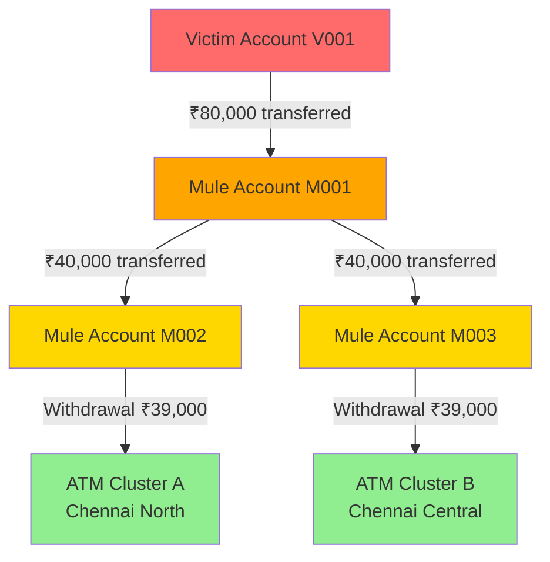
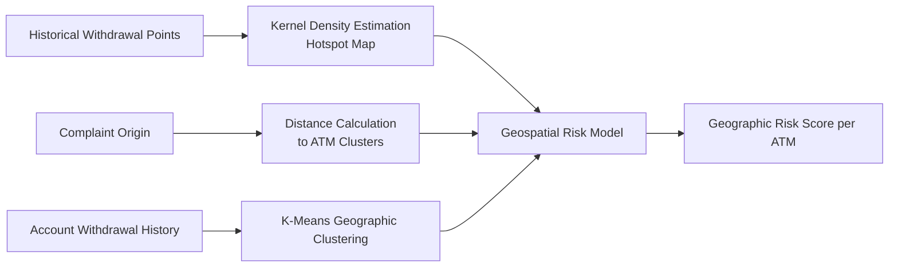
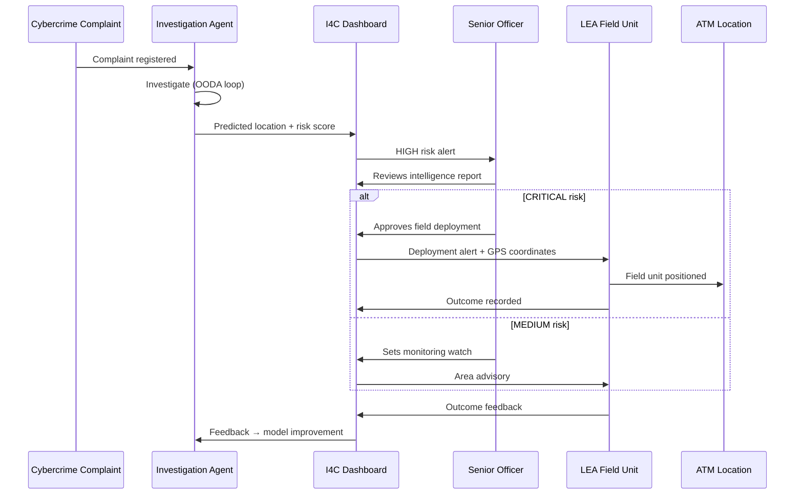
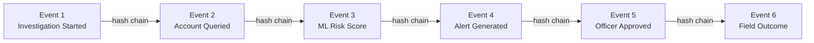
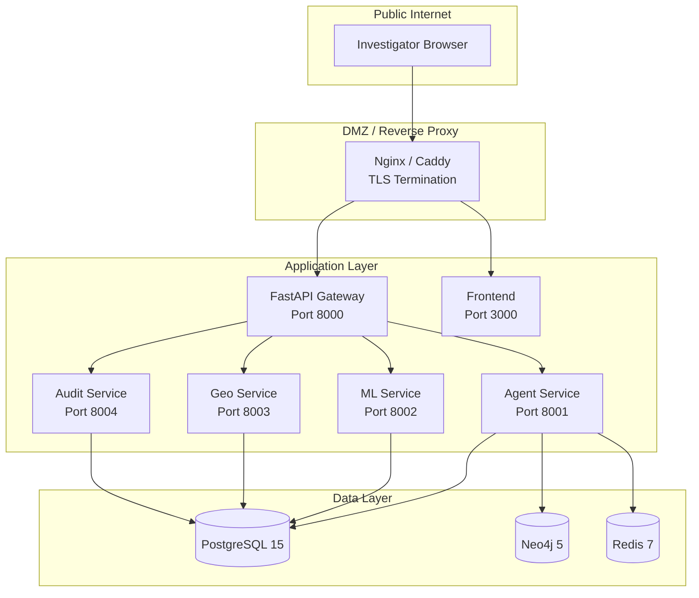

# Predictive Cybercrime Cash Withdrawal Intelligence System (PCCWIS)

> **Hackathon Project | Problem Statement ID: 26184**
> Ministry of Home Affairs · Indian Cyber Crime Coordination Centre (I4C), CIS Division
> Theme: Blockchain & Cybersecurity

---

## Table of Contents

1. [Problem Statement](#1-problem-statement)
2. [Problem Background](#2-problem-background)
3. [Problem Interpretation](#3-problem-interpretation)
4. [Why Reactive Systems Are Insufficient](#4-why-reactive-systems-are-insufficient)
5. [Proposed Solution](#5-proposed-solution)
6. [Core Innovation](#6-core-innovation)
7. [System Objectives](#7-system-objectives)
8. [End-to-End Architecture](#8-end-to-end-architecture)
9. [High-Level Architecture Diagram](#9-high-level-architecture-diagram)
10. [Component Architecture](#10-component-architecture)
11. [Agentic Architecture](#11-agentic-architecture)
12. [ML Architecture](#12-ml-architecture)
13. [Transaction Graph Architecture](#13-transaction-graph-architecture)
14. [Geospatial Architecture](#14-geospatial-architecture)
15. [Risk Fusion Engine](#15-risk-fusion-engine)
16. [Alert System](#16-alert-system)
17. [Law Enforcement Workflow](#17-law-enforcement-workflow)
18. [Blockchain / Audit Architecture](#18-blockchain--audit-architecture)
19. [Explainable AI](#19-explainable-ai)
20. [Human-in-the-Loop Design](#20-human-in-the-loop-design)
21. [Dataset Strategy](#21-dataset-strategy)
22. [Synthetic Data Strategy](#22-synthetic-data-strategy)
23. [Database Schema Overview](#23-database-schema-overview)
24. [Backend Architecture](#24-backend-architecture)
25. [Frontend Architecture](#25-frontend-architecture)
26. [ML Service Architecture](#26-ml-service-architecture)
27. [Agent Service Architecture](#27-agent-service-architecture)
28. [API Architecture](#28-api-architecture)
29. [Security Architecture](#29-security-architecture)
30. [Privacy Architecture](#30-privacy-architecture)
31. [Threat Model](#31-threat-model)
32. [Model Evaluation](#32-model-evaluation)
33. [Agent Evaluation](#33-agent-evaluation)
34. [Fraud Prediction Evaluation](#34-fraud-prediction-evaluation)
35. [Location Prediction Evaluation](#35-location-prediction-evaluation)
36. [Lead-Time Evaluation](#36-lead-time-evaluation)
37. [False-Positive Handling](#37-false-positive-handling)
38. [Demo Scenario](#38-demo-scenario)
39. [Judge Demonstration Flow](#39-judge-demonstration-flow)
40. [Deployment Architecture](#40-deployment-architecture)
41. [Technology Stack](#41-technology-stack)
42. [Folder Structure](#42-folder-structure)
43. [Development Phases](#43-development-phases)
44. [Future Improvements](#44-future-improvements)
45. [Limitations](#45-limitations)
46. [Ethical Considerations](#46-ethical-considerations)
47. [Assumptions](#47-assumptions)
48. [Disclaimer](#48-disclaimer)

---

## 1. Problem Statement

**ID:** 26184

**Title:**
> Development of a Predictive Analytics Framework for Cybercrime Complaints to Forecast Likely Cash Withdrawal Locations in Advance, Enabling Generation of Actionable Intelligence for Timely and Proactive Cybercrime Intervention.

**Organization:** Ministry of Home Affairs

**Department:** Indian Cyber Crime Coordination Centre (I4C), CIS Division

**Theme:** Blockchain & Cybersecurity

---

## 2. Problem Background

The National Cybercrime Reporting Portal (NCRP) receives approximately **8,000 cybercrime complaints daily**. The majority of financial cybercrimes follow a pattern: fraudsters deceive victims into transferring money, immediately layer it through multiple accounts ("mule accounts"), and finally withdraw cash at ATMs — often within hours of the initial fraud.

Current law enforcement approaches are **reactive**: investigators respond *after* the crime has been reported and often *after* the fraudster has already withdrawn the money and disappeared. By the time a complaint is lodged, reviewed, and escalated to field teams:

- Cash has often already been withdrawn
- Fraudsters have dispersed
- Mule account holders have been replaced or discarded
- Evidence has been dissipated across financial and geographic channels

The challenge is to move from **reactive detection** to **proactive prediction**:

> _"Can we predict WHERE and WHEN the fraudster is likely to withdraw cash — before it happens — so that law enforcement can position resources in advance?"_

---

## 3. Problem Interpretation

The problem requires building **a multi-layered predictive intelligence system** that:

1. **Ingests** cybercrime complaints as soon as they are filed
2. **Investigates** the associated financial transaction network using graph analysis
3. **Analyzes** behavioral, geographic, temporal, and network patterns using ML models
4. **Predicts** likely future cash-withdrawal locations (ATMs, bank branches)
5. **Generates** calibrated risk scores for predicted locations
6. **Alerts** law enforcement, banks, and I4C with actionable intelligence — **before withdrawal occurs**
7. **Audits** every investigative action with a tamper-evident trail
8. **Explains** every prediction in human-readable form for investigator trust and courtroom admissibility

This is **not** a simple fraud detection flag. It is a **predictive intelligence pipeline** that must work within hours of complaint registration, reason over financial networks, and produce geographic predictions with evidence-backed confidence levels.

---

## 4. Why Reactive Systems Are Insufficient

| Dimension | Reactive Approach | Proactive Approach (This System) |
|---|---|---|
| **Timing** | After withdrawal | Before withdrawal |
| **Action** | Freeze accounts retroactively | Alert LEA to position at predicted ATMs |
| **Scope** | Single complaint | Complaint + transaction network + geography |
| **Speed** | Hours to days | Minutes to 1–2 hours |
| **Evidence** | Post-event reconstruction | Real-time investigation graph with audit hash |
| **Intelligence** | Who did it | Where will it happen next |
| **LEA Value** | Arrest after loss | Interception before loss |

**Why existing systems fail:**

- **Siloed data:** Complaints, banking records, and ATM data sit in separate systems with no automated cross-referencing
- **Manual investigation:** Investigators manually trace account chains, which takes days
- **No geographic intelligence:** No system currently correlates withdrawal geography with complaint metadata
- **Reactive alerts:** Alerts are generated after fraudulent transactions have cleared
- **No temporal modeling:** No system models the time-window between fraud and withdrawal

---

## 5. Proposed Solution

PCCWIS is a **seven-layer Agentic Predictive Intelligence System**:

```
Cybercrime Complaint
        ↓
Investigation Agent (LangGraph-based OODA Loop)
        ↓
Observe → Reason → Plan → Act
        ↓
Transaction Graph Engine  +  Geospatial Engine  +  ML Models
        ↓
Risk Fusion Engine (calibrated multi-signal risk score)
        ↓
Withdrawal Location Prediction
        ↓
Policy / Threshold Verification (human-in-the-loop gate)
        ↓
Alert
        ↓
LEA / Bank / I4C Dashboard
        ↓
Outcome (was the prediction correct?)
        ↓
Feedback → Model Retraining / Agent Improvement
```

**The core insight:** By treating a cybercrime complaint as the starting node of a **financial transaction knowledge graph**, we can traverse the network to mule accounts, detect behavioral patterns identical to historical fraud cases, and use geospatial + temporal ML models to predict the most probable ATM withdrawal locations — typically 1–3 hours before withdrawal occurs.

---

## 6. Core Innovation

| Innovation | Description |
|---|---|
| **Agentic Investigation** | LangGraph-orchestrated OODA loop that autonomously plans and executes multi-step financial investigations |
| **Multi-hop Graph Tracing** | Automated traversal of mule account chains up to N hops from victim account |
| **Withdrawal Location Prediction** | Geographic ML model (not LLM) predicts likely ATM clusters based on account behavior history |
| **Risk Fusion** | Independent signals from graph, ML, and geospatial engines are fused into a calibrated confidence score |
| **Lead-Time Intelligence** | Generates intelligence 1–3 hours before predicted withdrawal window |
| **Blockchain Evidence** | Every investigative event is hashed and recorded on an audit chain — tamper-evident, court-admissible |
| **Explainable Predictions** | Every alert includes human-readable chain-of-reasoning from complaint to predicted location |
| **Human-in-the-Loop Gate** | High-confidence / high-impact alerts require senior officer approval before field deployment |

---

## 7. System Objectives

1. **Predict** likely cash-withdrawal ATM locations within **2 hours** of complaint registration
2. **Investigate** transaction networks automatically using a controlled agentic loop
3. **Generate** calibrated risk scores for predicted withdrawal locations
4. **Alert** LEA, banks, and I4C with actionable geo-intelligence
5. **Explain** every prediction with traceable evidence chains
6. **Audit** every investigative step with a tamper-evident blockchain record
7. **Minimize** false positives through policy thresholds and human-in-the-loop gates
8. **Improve** over time through feedback from actual withdrawal outcomes
9. **Protect** PII and sensitive banking data throughout the pipeline
10. **Operate** on synthetic / publicly available datasets for the prototype

---

## 8. End-to-End Architecture

The system consists of **9 independent but orchestrated layers**:

| Layer | Name | Responsibility |
|---|---|---|
| 1 | **Investigation Agent** | Orchestration, reasoning, tool selection, report generation |
| 2 | **Transaction Graph Engine** | Account relationships, multi-hop tracing, suspicious path detection |
| 3 | **ML Models** | Fraud classification, anomaly detection, risk scoring, withdrawal prediction |
| 4 | **Geospatial Engine** | ATM risk scoring, hotspot detection, geographic clustering |
| 5 | **Risk Fusion Engine** | Combines signals → calibrated risk score |
| 6 | **Policy / Safety Layer** | Threshold checking, human approval gates, scope limits |
| 7 | **Blockchain / Audit Layer** | Evidence hashing, tamper-evident audit trail |
| 8 | **Database Layer** | Complaints, accounts, transactions, predictions, alerts |
| 9 | **Frontend / Dashboard** | GIS heatmap, investigation view, alert management |

> **Critical Design Principle:** The LLM/Agent is responsible for **reasoning, planning, and orchestration**. It is NOT the fraud predictor. All numerical risk scores come from purpose-built ML models and the Risk Fusion Engine.

---

## 9. High-Level Architecture Diagram



---

## 10. Component Architecture

### 10.1 Service Decomposition

```
pccwis/
├── api-gateway/          # FastAPI gateway, auth, rate limiting
├── agent-service/        # LangGraph investigation agent
├── ml-service/           # ML models, training, inference
├── graph-service/        # Transaction graph engine (Neo4j)
├── geo-service/          # Geospatial analysis (PostGIS)
├── risk-fusion-service/  # Risk score aggregation
├── alert-service/        # Alert generation and delivery
├── audit-service/        # Blockchain/hash audit trail
├── frontend/             # React dashboard + GIS heatmap
└── database/             # Schema migrations, seed data
```

### 10.2 Inter-Service Communication

| From | To | Protocol |
|---|---|---|
| Frontend | API Gateway | HTTPS / REST |
| API Gateway | Agent Service | REST / gRPC |
| Agent Service | ML Service | REST (internal) |
| Agent Service | Graph Service | REST / Bolt (Neo4j) |
| Agent Service | Geo Service | REST (internal) |
| Agent Service | Risk Fusion | REST (internal) |
| Risk Fusion | Alert Service | REST (internal) |
| All Services | Audit Service | Event queue (Redis Streams) |
| All Services | Database | PostgreSQL driver |

---

## 11. Agentic Architecture

The Investigation Agent is built using **LangGraph**, implementing a controlled **OODA (Observe–Orient–Decide–Act)** loop extended with **Verify**, **Predict**, and **Report** phases.

### 11.1 Agent Responsibilities

✅ **What the agent DOES:**
- Orchestrates the investigation workflow
- Decides which tool to call next based on current evidence state
- Plans multi-step investigation paths
- Generates investigation summaries and intelligence reports
- Explains the reasoning behind each prediction
- Enforces investigation scope limits (depth, time, tool calls)

❌ **What the agent does NOT do:**
- Directly assign numerical fraud/risk scores (ML models do this)
- Directly access arbitrary database rows
- Directly modify financial records
- Directly contact external parties
- Bypass policy or safety thresholds
- Predict withdrawal locations itself (ML service does this)

### 11.2 Agent Loop



### 11.3 Investigation Scope Limits

| Parameter | Limit | Reason |
|---|---|---|
| `max_graph_depth` | 5 hops | Prevents infinite traversal |
| `max_accounts_investigated` | 50 accounts | Prevents resource exhaustion |
| `max_tool_calls` | 100 calls | LLM cost and time control |
| `max_investigation_time` | 30 minutes | SLA requirement |
| `max_retries_per_tool` | 3 | Error resilience |

---

## 12. ML Architecture

> **Important:** The LLM/Agent does NOT perform numerical fraud detection. All risk scores are produced by purpose-built, interpretable ML models.

### 12.1 ML Model Registry

| Model | Type | Input | Output | Library |
|---|---|---|---|---|
| **FraudClassifier** | Supervised - XGBoost | Transaction features (amount, velocity, hour, etc.) | Fraud probability [0,1] | XGBoost |
| **AnomalyDetector** | Unsupervised - Isolation Forest | Account behavioral features | Anomaly score [-1, 1] | scikit-learn |
| **AccountRiskScorer** | Supervised - LightGBM ensemble | Account profile + network features | Risk score [0,100] | LightGBM |
| **WithdrawalLocationPredictor** | Supervised - Gradient Boosting / KDE | Historical withdrawal coords + temporal + network features | Top-K ATM cluster predictions with probability | scikit-learn / statsmodels |
| **TransactionAnomalyDetector** | Unsupervised - Local Outlier Factor | Transaction sequence features | Outlier probability | scikit-learn |

### 12.2 ML Data Flow



### 12.3 Feature Engineering

**Transaction features:**
- Transaction amount (normalized)
- Time of day, day of week
- Transaction velocity (count per hour/day)
- Geographic distance from previous transaction
- Round-amount flag (amounts like ₹10,000, ₹50,000)
- Inter-account transfer depth
- Time since account opened

**Account features:**
- Account age
- KYC completeness score
- Historical fraud association score (from graph neighbors)
- Centrality in transaction graph (betweenness, degree)
- Number of unique recipients
- Average transaction amount

**Geographic features:**
- Distance from complaint origin to nearest ATM cluster
- Historical withdrawal density at location
- Time-weighted hotspot score
- Number of prior cybercrime complaints in area

---

## 13. Transaction Graph Architecture

### 13.1 Graph Data Model

```
(Account)-[:TRANSFERRED_TO {amount, timestamp, txn_id}]->(Account)
(Account)-[:WITHDREW_AT {amount, timestamp, atm_id}]->(ATM)
(Account)-[:LINKED_TO {link_type}]->(Account)
(Complaint)-[:INVOLVES]->(Account)
(ATM)-[:LOCATED_AT]->(Location)
```

### 13.2 Neo4j Graph Schema

```
Nodes:
  - Account(id, type, bank, risk_score, kyc_score)
  - Transaction(id, amount, timestamp, channel)
  - ATM(id, location_id, bank, type)
  - Location(lat, lon, district, state, pincode)
  - Complaint(id, amount, timestamp, victim_account_id)

Relationships:
  - TRANSFERRED_TO(amount, timestamp)
  - WITHDREW_AT(amount, timestamp)
  - INVOLVES(role: victim/mule/suspect)
  - LOCATED_IN
```

### 13.3 Multi-Hop Traversal Algorithm



### 13.4 Suspicious Path Detection

The graph engine uses the following heuristics to flag suspicious paths:

- **Layering detection:** 3+ sequential transfers within 30 minutes
- **Structuring detection:** Multiple withdrawals just below ₹50,000 (structuring to avoid monitoring)
- **Round-trip detection:** Funds returning to originating account chain
- **Fan-out detection:** Single account distributing to 5+ recipients within 1 hour
- **Smurfing detection:** Multiple accounts withdrawing at same ATM within 1-hour window

---

## 14. Geospatial Architecture

### 14.1 Geospatial Data Model

```
ATM location → geocoded (lat/lon)
Complaint origin → geocoded from PIN/district
Historical withdrawal clusters → KDE hotspots
Risk zone polygons → administrative boundary + historical crime density
```

### 14.2 Geospatial Analysis Pipeline



### 14.3 Risk Zone Generation

Risk zones are generated by overlaying:
1. Historical cybercrime complaint density (geographic)
2. Historical ATM withdrawal clusters associated with confirmed fraud
3. Time-of-day weighted activity patterns
4. Distance decay from complaint origin

---

## 15. Risk Fusion Engine

### 15.1 Signal Sources

The Risk Fusion Engine receives **independent** risk signals from:

| Signal | Source | Weight |
|---|---|---|
| Transaction fraud probability | FraudClassifier (ML) | 0.25 |
| Account anomaly score | AnomalyDetector (ML) | 0.20 |
| Account risk score | AccountRiskScorer (ML) | 0.20 |
| Graph suspicion score | Transaction Graph Engine | 0.15 |
| Geographic risk score | Geospatial Engine | 0.15 |
| Temporal pattern score | Time-series analysis | 0.05 |

### 15.2 Fusion Formula

```
FusedRiskScore = Σ(weight_i × signal_i) × temporal_decay_factor × graph_depth_penalty
```

**Calibration:** Scores are calibrated using Platt scaling against historical confirmed outcomes to produce proper probabilities.

### 15.3 Risk Thresholds

| Risk Score | Level | Action |
|---|---|---|
| 0 – 39 | LOW | Log, monitor |
| 40 – 59 | MEDIUM | Enhanced monitoring, bank notification |
| 60 – 79 | HIGH | LEA alert, ATM area watch |
| 80 – 89 | CRITICAL | Immediate LEA deployment, human approval |
| 90 – 100 | EXTREME | Human escalation, account freeze request |

---

## 16. Alert System

### 16.1 Alert Types

| Alert Type | Recipient | Channel |
|---|---|---|
| `PREDICTED_WITHDRAWAL_HIGH` | LEA Field Unit | Dashboard + SMS |
| `PREDICTED_WITHDRAWAL_CRITICAL` | Senior Officer | Dashboard + SMS + Email |
| `ACCOUNT_FREEZE_REQUEST` | Bank SPOC | API notification |
| `INVESTIGATION_COMPLETE` | I4C Analyst | Dashboard |
| `HUMAN_APPROVAL_REQUIRED` | Senior Investigator | Dashboard + Email |

### 16.2 Alert Payload (Example)

```json
{
  "alert_id": "ALT-2024-001234",
  "complaint_id": "CMP-2024-987654",
  "severity": "HIGH",
  "risk_score": 78.4,
  "confidence": 0.82,
  "predicted_locations": [
    {
      "atm_id": "ATM-CHN-0042",
      "location": { "lat": 13.0827, "lon": 80.2707 },
      "district": "Chennai North",
      "probability": 0.67,
      "predicted_withdrawal_window": "2024-01-15T14:00:00Z to 2024-01-15T16:00:00Z"
    }
  ],
  "evidence_summary": "...",
  "audit_hash": "sha256:abc123...",
  "created_at": "2024-01-15T12:30:00Z"
}
```

---

## 17. Law Enforcement Workflow



---

## 18. Blockchain / Audit Architecture

### 18.1 Design Principles

- **Do NOT store PII or sensitive banking data on-chain**
- Store only **cryptographic hashes** of investigation events
- Each event produces a SHA-256 hash of its content
- Hashes are chained: `hash_n = SHA256(event_n + hash_{n-1})`
- Chain is stored in an immutable append-only log

### 18.2 Audited Events

| Event | Logged Data |
|---|---|
| Investigation started | complaint_id, agent_id, timestamp |
| Tool called | tool_name, input_hash, output_hash, timestamp |
| ML model queried | model_name, input_hash, output_hash, timestamp |
| Risk score calculated | fused_score, component_scores_hash, timestamp |
| Alert generated | alert_id, risk_score, location_hash, timestamp |
| Human approval | officer_id, decision, timestamp |
| Field outcome recorded | alert_id, outcome, timestamp |

### 18.3 Audit Chain Structure



---

## 19. Explainable AI

Every prediction includes a structured explanation for investigator trust and potential court use:

### 19.1 Explanation Structure

```json
{
  "prediction_id": "PRED-2024-001",
  "predicted_atm": "ATM-CHN-0042",
  "risk_score": 78.4,
  "explanation": {
    "summary": "High risk withdrawal predicted at Chennai North ATM within 2-hour window based on transaction graph analysis and historical behavioral patterns.",
    "evidence_chain": [
      "Complaint CMP-987654: ₹80,000 fraud reported at 12:15",
      "Victim account V001 → ₹80,000 → Mule account M001 (12:16)",
      "M001 → ₹40,000 → M002 (12:18) — structuring pattern detected",
      "M002 historical withdrawal pattern: Chennai North ATMs (67% of prior withdrawals)",
      "Geographic cluster analysis: ATM-CHN-0042 highest density match",
      "ML fraud classifier: 0.91 fraud probability on M002 transaction pattern",
      "Account risk score: M002 = 84/100 (high risk)"
    ],
    "model_contributions": {
      "fraud_classifier": 0.25,
      "anomaly_detector": 0.18,
      "account_risk_scorer": 0.21,
      "graph_score": 0.15,
      "geographic_score": 0.14,
      "temporal_score": 0.07
    },
    "confidence_note": "This is a probabilistic prediction, not a certainty. Law enforcement should treat this as actionable intelligence requiring field verification."
  }
}
```

### 19.2 SHAP-Based Feature Importance

For the ML models, SHAP (SHapley Additive exPlanations) values are calculated to show which features drove each prediction:

- High positive SHAP: features that increased fraud probability
- High negative SHAP: features that decreased fraud probability
- Displayed in investigation dashboard as ranked feature bars

---

## 20. Human-in-the-Loop Design

### 20.1 Approval Gates

| Trigger | Required Approver | Action Options |
|---|---|---|
| Risk score ≥ 80 | Senior Investigator | Approve / Reject / Request more evidence |
| Account freeze request | Bank SPOC + Senior Officer | Approve / Reject |
| Field deployment (CRITICAL) | District Cybercrime Head | Approve / Reject |
| Cross-state investigation | State SPOC | Approve / Reject |

### 20.2 Human Review Interface

The dashboard provides investigators with:
- Full investigation timeline
- Evidence chain (human-readable)
- SHAP feature explanations
- Predicted location on map
- Confidence interval
- Historical accuracy for similar cases
- One-click Approve / Reject / Escalate

### 20.3 Override Logging

All human overrides (approve / reject) are:
- Recorded with officer ID, timestamp, and reason
- Hashed into the audit chain
- Included in model feedback for future improvement

---

## 21. Dataset Strategy

### 21.1 Public / Synthetic Datasets

| Dataset | Source | Purpose |
|---|---|---|
| **IBM AMLSim** | IBM Research (GitHub) | Synthetic AML/banking transaction graphs |
| **PaySim** | Kaggle / IEEE | Synthetic mobile money fraud transactions |
| **IEEE-CIS Fraud Detection** | Kaggle | Real anonymized transaction fraud features |
| **Custom India ATM Layer** | Synthetic generation | ATM locations, district mapping, PIN codes |
| **Custom Complaint Layer** | Synthetic generation | Simulated NCRP-style complaint records |

### 21.2 Data Disclaimer

> ⚠️ This prototype uses **entirely synthetic and publicly available anonymized datasets**. No real Indian banking data, no real cybercrime case data, and no real citizen PII is used. The system's performance on real I4C data would require separate validation.

---

## 22. Synthetic Data Strategy

### 22.1 Synthetic Complaint Generation

```python
# Synthetic complaint fields
{
    "complaint_id": "CMP-SYN-XXXX",
    "reported_at": "timestamp",
    "victim_account_id": "V-SYN-XXXX",
    "fraud_amount_inr": "random 10000-500000",
    "complaint_type": ["UPI fraud", "OTP fraud", "KYC fraud", ...],
    "district": "random from India district list",
    "pincode": "matching district",
    "victim_bank": "random from public bank list"
}
```

### 22.2 Synthetic Transaction Graph Generation

Using IBM AMLSim's graph generation model:
- N accounts (mix of legitimate and mule)
- Transaction patterns matching known AML typologies
- Temporal patterns simulating realistic banking hours
- Injection of known fraud patterns (layering, structuring, smurfing)

### 22.3 Synthetic ATM Layer

- ~500 synthetic ATM locations mapped to India districts
- Each ATM has: ID, lat/lon, bank, cash capacity flag, historical transaction volume
- ATM cluster assignments generated by K-means on district centroids

---

## 23. Database Schema Overview

### 23.1 PostgreSQL Tables

```sql
-- Core entities
complaints(id, complaint_no, reported_at, victim_account_id, amount, type, district, pincode, status)
accounts(id, account_no, bank, type, opened_at, kyc_score, risk_score, is_mule_suspect)
transactions(id, from_account, to_account, amount, timestamp, channel, reference_no)
withdrawals(id, account_id, atm_id, amount, timestamp, location_id)
atms(id, bank, location_id, type, status)
locations(id, lat, lon, district, state, pincode, city)

-- Investigation entities
investigations(id, complaint_id, agent_run_id, status, started_at, completed_at, max_depth_reached)
investigation_events(id, investigation_id, event_type, tool_name, input_hash, output_hash, timestamp)
account_risk_assessments(id, account_id, investigation_id, risk_score, model_version, assessed_at)

-- Prediction entities
withdrawal_predictions(id, investigation_id, atm_id, probability, risk_score, predicted_window_start, predicted_window_end, created_at)
prediction_outcomes(id, prediction_id, actual_occurred, actual_atm_id, recorded_at)

-- Alert entities
alerts(id, investigation_id, severity, risk_score, status, created_at, approved_by, approved_at)
alert_locations(id, alert_id, atm_id, probability, rank)

-- Audit entities
audit_events(id, investigation_id, event_type, event_hash, previous_hash, chain_hash, timestamp)
```

---

## 24. Backend Architecture

### 24.1 API Gateway (FastAPI)

- JWT authentication with role-based access control
- Rate limiting (per-user and per-endpoint)
- Request/response validation with Pydantic
- OpenAPI documentation auto-generated
- Audit logging middleware

### 24.2 Service Stack

```
FastAPI (API Gateway)
    ↓
Agent Service (LangGraph + LLM)
    ↓
[ML Service | Graph Service | Geo Service | Risk Fusion]
    ↓
[PostgreSQL | Neo4j | Redis]
    ↓
Audit Service → Blockchain/Hash Chain
```

---

## 25. Frontend Architecture

### 25.1 Tech Stack

| Component | Technology |
|---|---|
| Framework | React 18 + TypeScript |
| GIS Heatmap | Leaflet.js + react-leaflet |
| Charts | Recharts / Chart.js |
| Transaction Graph | React Flow / D3.js |
| State | Zustand |
| API Client | Axios + React Query |
| Design | Tailwind CSS + shadcn/ui |

### 25.2 Dashboard Pages

| Page | Description |
|---|---|
| `/dashboard` | Overview: alerts, active investigations, risk metrics |
| `/investigations/:id` | Investigation detail: OODA loop timeline, graph view |
| `/map` | GIS heatmap: risk zones, predicted ATM locations |
| `/alerts` | Alert management: review, approve, reject |
| `/complaints` | Complaint intake and tracking |
| `/reports` | Generated intelligence reports |
| `/audit/:id` | Audit trail viewer |
| `/admin` | User management, model configuration |

---

## 26. ML Service Architecture

```
ml-service/
├── models/
│   ├── fraud_classifier.py       # XGBoost fraud classification
│   ├── anomaly_detector.py       # Isolation Forest
│   ├── account_risk_scorer.py    # LightGBM account risk
│   └── withdrawal_location_predictor.py  # Gradient Boost + KDE
├── features/
│   ├── transaction_features.py   # Feature engineering
│   ├── account_features.py
│   └── geographic_features.py
├── training/
│   ├── train_fraud_classifier.py
│   └── train_location_predictor.py
├── serving/
│   └── api.py                    # FastAPI serving endpoints
└── evaluation/
    └── metrics.py                # Evaluation scripts
```

---

## 27. Agent Service Architecture

```
agent-service/
├── graph/
│   ├── investigation_graph.py    # LangGraph StateGraph definition
│   ├── nodes.py                  # Individual node implementations
│   ├── edges.py                  # Conditional routing logic
│   └── state.py                  # InvestigationState schema
├── tools/
│   ├── complaint_tools.py        # get_complaint()
│   ├── account_tools.py          # get_account(), get_related_accounts()
│   ├── transaction_tools.py      # get_transactions(), trace_transaction_graph()
│   ├── ml_tools.py               # calculate_account_risk(), predict_withdrawal_location()
│   ├── geo_tools.py              # get_atm_locations(), get_geographic_risk()
│   ├── alert_tools.py            # create_alert()
│   ├── report_tools.py           # generate_report()
│   └── audit_tools.py            # record_audit_event()
├── policy/
│   └── limits.py                 # Scope limits, thresholds
└── api.py                        # Investigation API endpoint
```

---

## 28. API Architecture

See [`rea_api_system.md`](./rea_api_system.md) for complete API documentation.

**Key API Groups:**
- `/api/v1/auth/` — Authentication
- `/api/v1/complaints/` — Complaint management
- `/api/v1/investigations/` — Investigation lifecycle
- `/api/v1/accounts/` — Account data
- `/api/v1/predictions/` — ML withdrawal predictions
- `/api/v1/risk-zones/` — Geographic risk
- `/api/v1/alerts/` — Alert management
- `/api/v1/reports/` — Intelligence reports
- `/api/v1/audit/` — Audit trail

---

## 29. Security Architecture

### 29.1 Authentication & Authorization

- **JWT tokens** (HS256/RS256) with short expiry (15 min) + refresh tokens
- **RBAC roles:**

| Role | Permissions |
|---|---|
| `analyst` | Read complaints, investigations, view predictions |
| `investigator` | Create investigations, approve medium alerts |
| `senior_officer` | Approve critical alerts, request account freeze |
| `admin` | User management, model configuration |
| `bank_spoc` | Receive freeze requests, acknowledge alerts |
| `lea_officer` | Receive field alerts, record outcomes |

### 29.2 API Security

- TLS 1.3 everywhere (internal + external)
- API rate limiting: 100 req/min (analyst), 200 req/min (investigator)
- Input validation with Pydantic — no raw SQL injection possible
- CORS properly configured (whitelisted origins only)
- Secrets stored in environment variables (never in code)

### 29.3 Agent / LLM Security

| Control | Implementation |
|---|---|
| Tool authorization | Each tool checks caller permissions before executing |
| Maximum tool calls | Hard limit enforced in agent loop |
| Prompt injection | User-provided text is sanitized before LLM input |
| No direct DB access | Agent only accesses DB through controlled tool APIs |
| No financial writes | Agent cannot modify account balances or transfer records |
| No external calls | Agent cannot call external APIs directly |
| Sandboxed execution | Agent runs in isolated container |

---

## 30. Privacy Architecture

- **PII minimization:** Only account IDs (not real account numbers) used in agent and ML pipelines
- **Data masking:** Account numbers masked in logs and audit records
- **Access control:** Analysts can see investigation summaries but not raw PII without senior approval
- **Data retention:** Investigation data retained per legal requirement; PII scrubbed after investigation closure (configurable)
- **Encryption at rest:** PostgreSQL tablespace-level encryption
- **Encryption in transit:** TLS everywhere

---

## 31. Threat Model

| Threat | Mitigation |
|---|---|
| Prompt injection attack on LLM | Input sanitization, tool permission checks |
| Unauthorized account data access | RBAC, audit logging of all data access |
| Model poisoning | Training data validation, model versioning, anomaly monitoring |
| Alert flooding / false positives | Policy thresholds, rate limiting, human approval |
| Audit trail tampering | Hash chain verification, append-only log |
| API abuse | Rate limiting, JWT validation, IP allowlisting |
| Insider threat | Audit logging of all human actions, dual-approval for critical actions |
| Data exfiltration | No raw PII in logs, DLP controls |

---

## 32. Model Evaluation

### 32.1 Training Data Split

- 70% training, 15% validation, 15% holdout test
- Temporal split: train on older data, test on newer (prevents data leakage)

### 32.2 Key Metrics

| Model | Metric | Target |
|---|---|---|
| FraudClassifier | Precision, Recall, F1, AUC-ROC | Recall ≥ 0.85, Precision ≥ 0.70 |
| AnomalyDetector | Anomaly Rate, False Positive Rate | FPR ≤ 0.10 |
| AccountRiskScorer | MAE, Spearman rank correlation | Rank correlation ≥ 0.75 |
| WithdrawalLocationPredictor | Top-K Accuracy, Haversine Distance Error | Top-3 accuracy ≥ 0.60 |

---

## 33. Agent Evaluation

| Metric | Description | Target |
|---|---|---|
| Investigation completion rate | % of complaints fully investigated | ≥ 95% |
| Time to prediction | Minutes from complaint to first prediction | ≤ 30 minutes |
| Tool call efficiency | Average tool calls per investigation | ≤ 25 |
| False escalation rate | % of HIGH alerts that were incorrect | ≤ 15% |
| Human approval rate | % of CRITICAL alerts approved by officers | Baseline metric |

---

## 34. Fraud Prediction Evaluation

The system does **not** claim to perfectly predict fraud. Evaluation is probabilistic:

- **Precision@K:** Of the top K predicted withdrawal locations, what fraction are correct?
- **Recall@K:** Of actual withdrawals, what fraction are in the top K predictions?
- **Calibration:** Do predicted probabilities match observed frequencies?
- **Lead time:** How many minutes before actual withdrawal was the prediction made?

> **Disclaimer:** Synthetic dataset evaluation results are indicative only. Real-world performance requires validation on I4C operational data.

---

## 35. Location Prediction Evaluation

| Metric | Description |
|---|---|
| Top-1 Accuracy | Exact ATM match in top prediction |
| Top-3 Accuracy | Correct ATM in top 3 predictions |
| District Accuracy | Correct district in top prediction |
| Mean Haversine Error | Average km distance between predicted and actual |
| Precision-Recall AUC | Area under PR curve for location predictions |

---

## 36. Lead-Time Evaluation

**Lead time** = Time of alert generation − Time of actual withdrawal

- Target: ≥ 60 minutes lead time for 70% of correct predictions
- Track distribution of lead times across test cases
- Report separately for HIGH vs CRITICAL alerts

---

## 37. False-Positive Handling

Controlling false positives is critical for LEA trust:

1. **Policy thresholds:** Only alerts above configured score thresholds are sent to LEA
2. **Human approval gates:** CRITICAL alerts require human review before field deployment
3. **Confidence intervals:** Predictions include confidence bounds, not just point estimates
4. **Historical accuracy display:** Dashboard shows accuracy of past predictions for similar patterns
5. **Feedback loop:** Officers record outcomes → model calibration improves
6. **Alert fatigue controls:** Maximum N alerts per officer per day; deduplication of similar alerts

---

## 38. Demo Scenario

**Scenario:** A ₹80,000 UPI fraud complaint is registered at 12:15 PM.

**Expected system behavior:**

| Time | Event |
|---|---|
| 12:15 | Complaint registered: CMP-2024-987654 |
| 12:16 | Agent starts investigation |
| 12:17 | Agent fetches victim account V001 |
| 12:18 | Agent traces transaction: V001 → M001 (₹80,000) |
| 12:19 | Agent finds fan-out: M001 → M002 (₹40k), M001 → M003 (₹40k) |
| 12:21 | Agent calculates account risk: M002=84, M003=79 |
| 12:23 | Agent queries withdrawal history for M002, M003 |
| 12:25 | ML model: withdrawal location prediction → ATM-CHN-0042 (67%), ATM-CHN-0017 (21%) |
| 12:26 | Geospatial risk: Chennai North cluster HIGH |
| 12:27 | Risk fusion: 78.4 (HIGH) |
| 12:28 | Policy check: threshold met for LEA alert |
| 12:29 | Alert ALT-001234 generated |
| 12:30 | Senior officer reviews report |
| 12:31 | Officer approves field deployment |
| 12:32 | LEA unit receives GPS coordinates |
| 14:05 | Actual withdrawal attempted at ATM-CHN-0042 |
| 14:06 | LEA intercepts |
| 14:10 | Outcome recorded: prediction correct |

---

## 39. Judge Demonstration Flow

1. Open dashboard → Active investigations
2. Show incoming complaint card
3. Click "Start Investigation" → Agent begins OODA loop
4. Show real-time investigation timeline (tool calls, evidence accumulation)
5. Show transaction graph visualization (multi-hop mule network)
6. Show ML model outputs (fraud probability, account risk scores)
7. Show geographic heatmap: predicted ATM locations highlighted
8. Show risk fusion score: 78.4 with component breakdown
9. Show explainability panel: evidence chain summary
10. Show alert generation and officer approval flow
11. Simulate "outcome reveal": prediction matched actual withdrawal
12. Show evaluation metric: Top-1 accuracy, lead time

---

## 40. Deployment Architecture



**Deployment:** Docker Compose (prototype) → Kubernetes (production)

---

## 41. Technology Stack

| Layer | Technology |
|---|---|
| **Agent Orchestration** | LangGraph, LangChain, Python 3.11+ |
| **LLM** | Google Gemini 1.5 Pro / OpenAI GPT-4o (configurable) |
| **ML Models** | scikit-learn, XGBoost, LightGBM, statsmodels |
| **Graph Database** | Neo4j 5 (Community) |
| **Relational Database** | PostgreSQL 15 + PostGIS |
| **Cache / State** | Redis 7 |
| **API Framework** | FastAPI + Pydantic v2 |
| **Frontend** | React 18 + TypeScript + Leaflet.js |
| **Container** | Docker + Docker Compose |
| **Audit / Hashing** | Python hashlib (SHA-256) |
| **Explainability** | SHAP |
| **Geospatial** | Shapely, GeoPandas, PostGIS |

---

## 42. Folder Structure

```
pccwis/
├── docs/                          # Documentation (this folder)
│   ├── README.md
│   ├── agent_workflow_diagram.md
│   ├── agent_code_learning.md
│   ├── rea_api_system.md
│   ├── langgraph_architecture_over.md
│   └── presentation.md
├── api-gateway/                   # FastAPI gateway
│   ├── main.py
│   ├── auth/
│   ├── middleware/
│   └── routes/
├── agent-service/                 # LangGraph agent
│   ├── graph/
│   ├── tools/
│   ├── policy/
│   └── api.py
├── ml-service/                    # ML models
│   ├── models/
│   ├── features/
│   ├── training/
│   ├── serving/
│   └── evaluation/
├── graph-service/                 # Neo4j graph engine
│   ├── queries/
│   └── api.py
├── geo-service/                   # Geospatial analysis
│   ├── analysis/
│   └── api.py
├── risk-fusion-service/           # Risk aggregation
│   └── fusion.py
├── alert-service/                 # Alert generation
│   └── alerts.py
├── audit-service/                 # Blockchain/hash audit
│   └── chain.py
├── frontend/                      # React dashboard
│   ├── src/
│   │   ├── pages/
│   │   ├── components/
│   │   └── hooks/
│   └── public/
├── database/
│   ├── migrations/
│   └── seeds/                     # Synthetic data seeds
├── data/                          # Synthetic datasets
│   ├── amlsim/
│   ├── paysim/
│   └── synthetic_india/
├── docker-compose.yml
├── .env.example
└── README.md                      # Points to docs/
```

---

## 43. Development Phases

| Phase | Duration | Deliverables |
|---|---|---|
| **Phase 1: Foundation** | Week 1 | DB schema, synthetic data, basic API |
| **Phase 2: ML Models** | Week 2 | Trained classifiers, withdrawal predictor, SHAP |
| **Phase 3: Graph Engine** | Week 2–3 | Neo4j setup, multi-hop traversal, suspicious path detection |
| **Phase 4: Agent** | Week 3–4 | LangGraph agent, OODA loop, tool implementations |
| **Phase 5: Risk Fusion** | Week 4 | Fusion engine, calibration, thresholds |
| **Phase 6: Alert + Audit** | Week 5 | Alert generation, hash chain, blockchain audit |
| **Phase 7: Frontend** | Week 5–6 | Dashboard, GIS heatmap, investigation view |
| **Phase 8: Integration** | Week 6 | End-to-end testing, demo scenario |

---

## 44. Future Improvements

1. **Real-time streaming:** Kafka-based event streaming for sub-minute complaint ingestion
2. **Federated learning:** Train models across bank silos without sharing raw data
3. **Graph neural networks:** GNN-based account risk scoring using graph topology
4. **Multi-modal signals:** Include call-center fraud signals, SMS patterns
5. **Cross-state coordination:** Multi-jurisdictional investigation coordination
6. **Natural language complaint analysis:** NLP to extract structured entities from free-text complaints
7. **Mobile app:** LEA field officer mobile application
8. **Automated evidence packaging:** Court-ready evidence document generation
9. **Real-time ATM feed:** Integration with bank ATM transaction streams
10. **Federated I4C integration:** Secure API integration with actual NCRP systems

---

## 45. Limitations

| Limitation | Description |
|---|---|
| **Synthetic data** | Performance on real I4C data unknown; requires separate validation |
| **LLM reasoning quality** | LLM orchestration quality depends on model version and prompt engineering |
| **Graph scalability** | Multi-hop traversal complexity grows with graph size; production requires query optimization |
| **False positives** | Predictive systems will produce incorrect predictions; human review is essential |
| **Privacy trade-offs** | More data improves prediction but increases privacy risk |
| **Model drift** | Fraud patterns evolve; models require continuous retraining |
| **No real NCRP integration** | Prototype uses simulated complaint intake |
| **No real bank API** | Account freeze requests are simulated |

---

## 46. Ethical Considerations

1. **Presumption of innocence:** The system generates probabilistic intelligence, NOT proof of guilt. No action should be taken based solely on system output without human review.
2. **Bias awareness:** ML models may exhibit geographic or demographic bias. Regular fairness audits are required.
3. **Transparency:** Explainability features ensure investigators understand why each prediction was made.
4. **Data minimization:** Only data necessary for the specific investigation should be accessed.
5. **Right to contest:** Citizens incorrectly flagged should have a mechanism to contest and have their data corrected.
6. **Proportionality:** High-impact actions (account freeze, field deployment) require proportionate evidence and human approval.
7. **Audit accountability:** Every action is logged so no investigator can claim unauthorized access.

---

## 47. Assumptions

1. Complaints are available in structured digital format within minutes of registration
2. Transaction data is accessible from banking partners within a defined window (simulated in prototype)
3. ATM location data is available in geocoded form
4. A secure network exists between I4C systems and partner banks (simulated in prototype)
5. Law enforcement field units have mobile connectivity for receiving GPS alerts
6. A senior officer is available 24/7 for critical alert approval (or an escalation chain exists)

---

## 48. Disclaimer

> This system is developed as a **hackathon prototype** for the I4C problem statement. It uses **entirely synthetic and publicly available anonymized datasets** (IBM AMLSim, PaySim, IEEE-CIS). No real citizen data, real banking records, real cybercrime case data, or real government systems are accessed, claimed, or used.
>
> Predictions generated by this system are **probabilistic intelligence estimates**, not certainties. The system is designed to **assist** human investigators, not replace them.
>
> All performance metrics quoted refer to evaluation on **synthetic data** and may not reflect real-world performance. Real deployment would require rigorous validation on actual I4C operational data under appropriate legal frameworks.
>
> The project does not claim access to I4C internal systems, NCRP databases, or any production banking infrastructure.

---

*Documentation version: 1.0 | Created for Hackathon Problem Statement ID 26184*
