# Agent Workflow Diagram

> **PCCWIS — Investigation Agent Technical Reference**
> Predictive Cybercrime Cash Withdrawal Intelligence System

---

## Table of Contents

1. [What Is the Investigation Agent?](#1-what-is-the-investigation-agent)
2. [Why Is the Agent Required?](#2-why-is-the-agent-required)
3. [Agent Responsibilities](#3-agent-responsibilities)
4. [Agent Non-Responsibilities](#4-agent-non-responsibilities)
5. [The Agentic Loop](#5-the-agentic-loop)
6. [Phase: OBSERVE](#6-phase-observe)
7. [Phase: REASON](#7-phase-reason)
8. [Phase: PLAN](#8-phase-plan)
9. [Phase: ACT](#9-phase-act)
10. [Phase: VERIFY](#10-phase-verify)
11. [Stop Conditions](#11-stop-conditions)
12. [Error Handling](#12-error-handling)
13. [Retry Behavior](#13-retry-behavior)
14. [Tool Selection](#14-tool-selection)
15. [Tool Calling Flow](#15-tool-calling-flow)
16. [Multi-Hop Transaction Investigation](#16-multi-hop-transaction-investigation)
17. [Account Investigation](#17-account-investigation)
18. [Graph Traversal](#18-graph-traversal)
19. [ATM Investigation](#19-atm-investigation)
20. [Geospatial Investigation](#20-geospatial-investigation)
21. [ML Model Interaction](#21-ml-model-interaction)
22. [Risk Engine Interaction](#22-risk-engine-interaction)
23. [Alert Generation](#23-alert-generation)
24. [Human Escalation](#24-human-escalation)
25. [Feedback Loop](#25-feedback-loop)

---

## 1. What Is the Investigation Agent?

The **Investigation Agent** is the central orchestrating intelligence of PCCWIS. It is a **LangGraph-based stateful agent** that:

- Receives a cybercrime complaint as its starting input
- Autonomously decides what information to gather next
- Calls domain-specific tools to retrieve evidence
- Coordinates with ML models to compute risk scores
- Decides when sufficient evidence has been gathered
- Produces an intelligence report and triggers alerts

The agent is powered by a **Large Language Model (LLM)** for reasoning, planning, and report generation — but critically, the LLM is **NOT** the fraud detector. The LLM orchestrates and reasons; dedicated ML models compute numerical risk.

> **Mental model:** The agent is like a seasoned financial crime analyst who knows *how* to investigate — which records to pull, in what order, when to escalate — but who consults specialist tools (transaction graph database, statistical models, geospatial tools) for the actual numerical analysis.

---

## 2. Why Is the Agent Required?

Financial cybercrime investigation is not a single-step query. It requires:

1. **Sequential decision-making:** Each piece of evidence informs what to investigate next
2. **Multi-source integration:** Transaction data, account data, geographic data, and ML outputs must be combined
3. **Adaptive planning:** The investigation path changes based on what is found
4. **Multi-hop traversal:** Money moves through chains of accounts — you must follow the chain
5. **Evidence coherence:** All gathered evidence must be tied together into a coherent narrative

A static rule engine or single API call cannot do this. A multi-step, stateful, reasoning agent can.

---

## 3. Agent Responsibilities

| Responsibility | Description |
|---|---|
| **Complaint Ingestion** | Parse complaint, extract victim account, fraud amount, timestamps |
| **Investigation Planning** | Decide sequence of investigation steps |
| **Tool Orchestration** | Select and call appropriate tools in correct sequence |
| **Evidence Accumulation** | Maintain investigation state across all tool calls |
| **Graph Traversal Coordination** | Instruct graph traversal tools with appropriate depth limits |
| **ML Service Coordination** | Pass correct feature sets to ML models, interpret results |
| **Risk Assessment Integration** | Pass all signals to Risk Fusion Engine |
| **Evidence Verification** | Check consistency across evidence before finalizing |
| **Report Generation** | Create human-readable intelligence report |
| **Alert Initiation** | Trigger appropriate alert based on fused risk score |
| **Audit Recording** | Instruct audit service to record each event |
| **Human Escalation** | Recognize when human review is required and halt for approval |

---

## 4. Agent Non-Responsibilities

The following are explicitly **outside** agent scope:

| Non-Responsibility | Why |
|---|---|
| **Fraud probability calculation** | ML models (XGBoost, LightGBM) compute this |
| **Withdrawal location prediction** | WithdrawalLocationPredictor ML model computes this |
| **Risk score assignment** | Risk Fusion Engine computes calibrated scores |
| **Direct database queries** | Tools provide controlled data access |
| **Account balance modification** | Never allowed — financial writes are prohibited |
| **Account freeze execution** | Requires human approval + bank SPOC action |
| **External entity contact** | Agent cannot call external APIs without authorization |
| **Arbitrary SQL execution** | All data access is through typed, validated tool APIs |

---

## 5. The Agentic Loop

The agent follows an **OODA-extended loop**: Observe → Reason → Plan → Act (repeated) → Verify → Predict → Decide → Report/Alert

### Diagram A: Complete Agent Loop

```mermaid
stateDiagram-v2
    [*] --> OBSERVE : New complaint received

    OBSERVE --> REASON : Evidence snapshot ready
    REASON --> PLAN : Analysis complete
    PLAN --> ACT : Next tool(s) selected
    ACT --> OBSERVE : Tool results received

    note right of OBSERVE
        Snapshot current evidence state.
        What do we know?
        What is still unknown?
    end note

    note right of REASON
        LLM analyzes current state.
        Identifies gaps and next priorities.
        Checks scope limits.
    end note

    note right of PLAN
        LLM selects next tool call.
        Formats tool input.
        Checks if scope limit reached.
    end note

    note right of ACT
        Tool executed (controlled API).
        Result parsed and validated.
        State updated.
    end note

    OBSERVE --> VERIFY : Sufficient evidence gathered OR scope limit
    VERIFY --> PREDICT : Evidence coherent
    VERIFY --> OBSERVE : Gaps found — investigate more
    PREDICT --> DECIDE : Withdrawal prediction received from ML
    DECIDE --> REPORT : Risk threshold met
    DECIDE --> MONITOR : Low / medium risk
    DECIDE --> HUMAN_APPROVAL : Critical / extreme risk
    HUMAN_APPROVAL --> REPORT : Officer approves
    HUMAN_APPROVAL --> MONITOR : Officer declines
    REPORT --> ALERT : Report generated
    ALERT --> AUDIT : Alert dispatched
    AUDIT --> [*] : Investigation closed

    OBSERVE --> ABORT : Scope limit exceeded with no evidence
    ABORT --> AUDIT
```

**Node Explanations:**

| Node | Description |
|---|---|
| `OBSERVE` | Agent reads current `InvestigationState` — what evidence has been gathered so far |
| `REASON` | LLM analyzes the state: what patterns are emerging? what is still unknown? |
| `PLAN` | LLM decides the next investigation step: which tool? which account? |
| `ACT` | The selected tool is called; result is parsed and written to state |
| `VERIFY` | Agent checks if evidence is sufficient and coherent before predicting |
| `PREDICT` | ML service is called to produce withdrawal location prediction |
| `DECIDE` | Risk Fusion score is evaluated against policy thresholds |
| `HUMAN_APPROVAL` | Agent suspends and awaits officer decision |
| `REPORT` | Intelligence report is generated by LLM from accumulated evidence |
| `ALERT` | Alert is dispatched to LEA, bank, and I4C |
| `AUDIT` | All events are hashed and recorded in audit chain |
| `MONITOR` | Case is flagged for monitoring (lower priority) |
| `ABORT` | Investigation terminated due to scope limits with inconclusive evidence |

---

## 6. Phase: OBSERVE

In the OBSERVE phase, the agent reads the current `InvestigationState` and produces a structured snapshot.

**State snapshot includes:**
- Complaint metadata (ID, amount, victim account, timestamp)
- Accounts investigated so far
- Transactions traced so far
- Graph depth reached
- Tool calls made (count)
- ML scores received
- Flags raised (structuring, fan-out, smurfing, etc.)
- Outstanding unknowns (accounts not yet investigated)

**Agent question in OBSERVE:** _"What do I know right now, and what is still unknown?"_

**OBSERVE output:**
```json
{
  "known": {
    "victim_account": "V001",
    "fraud_amount": 80000,
    "traced_accounts": ["M001"],
    "transactions_traced": 1,
    "flags": ["large_transfer"],
    "ml_scores": {}
  },
  "unknown": [
    "destination accounts from M001",
    "withdrawal history of M001",
    "geographic risk of M001 activity"
  ],
  "scope_status": {
    "graph_depth": 1,
    "tool_calls": 3,
    "within_limits": true
  }
}
```

---

## 7. Phase: REASON

In the REASON phase, the LLM analyzes the OBSERVE snapshot and produces structured reasoning.

**Agent question in REASON:** _"Given what I know, what does the evidence suggest? What should I prioritize next?"_

**REASON output (LLM generates this structured analysis):**
```
Evidence so far:
- ₹80,000 transferred from victim V001 to mule M001 within 1 minute of fraud
- This matches known fraud layering pattern
- M001's destination accounts are unknown — CRITICAL GAP
- No withdrawal history known yet

Priority:
1. Trace outgoing transactions from M001 (immediate)
2. Calculate account risk for M001 (parallel)
3. Withdrawal history will follow after destination accounts identified

Scope check: 3 tool calls used of 100 maximum. Graph depth 1 of 5. Proceeding.
```

**Important:** The LLM does NOT assign a fraud probability number here. It reasons about investigation priorities.

---

## 8. Phase: PLAN

In the PLAN phase, the agent selects the next tool(s) to call and formats the tool inputs.

**Agent question in PLAN:** _"Which tool should I call next, with what parameters?"_

**PLAN output:**
```json
{
  "next_tool": "get_transactions",
  "tool_input": {
    "account_id": "M001",
    "direction": "outgoing",
    "limit": 20,
    "since": "2024-01-15T12:15:00Z"
  },
  "reasoning": "Must trace outgoing transactions from M001 to discover downstream mule accounts"
}
```

**Tool selection logic (LLM-guided but bounded by policy):**

| Current State | Likely Next Tool |
|---|---|
| Just received complaint | `get_complaint()` → `get_account()` |
| Have victim account | `get_transactions()` |
| Found outgoing transaction | `get_related_accounts()` |
| Have related accounts | `get_transactions()` for each |
| Traced N hops | `calculate_account_risk()` |
| Have account risk | `get_withdrawal_history()` |
| Have withdrawal history | `get_atm_locations()` |
| Have ATM data | `get_geographic_risk()` |
| Have geographic risk | `predict_withdrawal_location()` |
| Have prediction | `create_alert()` + `generate_report()` |

---

## 9. Phase: ACT

In the ACT phase, the selected tool is executed through the controlled tool API.

**Tool call is validated before execution:**
1. Permission check: does the agent have authorization for this tool?
2. Input validation: are all required fields present and valid?
3. Scope check: is the tool call count within limits?
4. Rate check: is the tool being called too rapidly?

**After tool execution:**
1. Output is parsed and validated
2. State is updated with new evidence
3. New flags are checked (structuring, fan-out, etc.)
4. Tool call count is incremented
5. Agent loops back to OBSERVE

---

## 10. Phase: VERIFY

VERIFY occurs when the agent believes sufficient evidence has been gathered (or scope limits have been reached).

**Verification checklist:**
- [ ] At least one suspicious account identified at ≥ hop 2?
- [ ] Account risk scores calculated for all suspect accounts?
- [ ] Withdrawal history retrieved for top 3 risk accounts?
- [ ] Geographic data retrieved?
- [ ] ML fraud probability calculated?
- [ ] No unexplained data contradictions?

If any critical item is missing and scope permits → return to OBSERVE.

If evidence is verified → proceed to PREDICT.

---

## 11. Stop Conditions

The investigation terminates (normally or forcibly) under these conditions:

| Condition | Type | Action |
|---|---|---|
| All evidence gathered, prediction made | Normal completion | Report → Alert |
| `max_graph_depth` (5) reached | Scope limit | Report with available evidence |
| `max_tool_calls` (100) reached | Scope limit | Report with available evidence |
| `max_investigation_time` (30 min) reached | Timeout | Report with partial evidence |
| `max_accounts_investigated` (50) reached | Scope limit | Report with available evidence |
| Tool failure after 3 retries | Error | Log error, continue with partial evidence |
| Human cancellation | Manual stop | Archive investigation state |
| No suspicious evidence at hop 3+ | Inconclusive | Low-priority monitor |

---

## 12. Error Handling

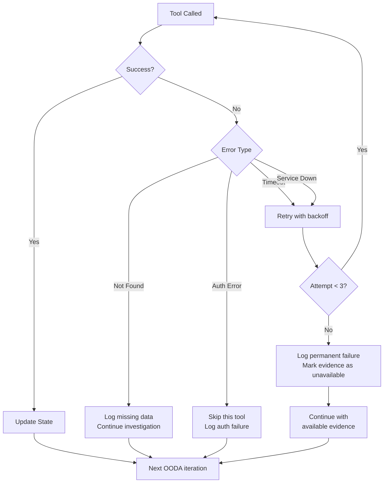

---

## 13. Retry Behavior

| Error Type | Retry Strategy | Max Retries |
|---|---|---|
| Network timeout | Exponential backoff: 1s, 2s, 4s | 3 |
| Service temporarily unavailable | Exponential backoff: 2s, 4s, 8s | 3 |
| Data not found | No retry (log and continue) | 0 |
| Authorization failure | No retry (log security event) | 0 |
| Invalid input | No retry (fix input schema) | 0 |

After `max_retries`, the tool call is marked as `FAILED`, the evidence is noted as `UNAVAILABLE`, and the investigation continues with whatever evidence is available.

---

## 14. Tool Selection

### Diagram B: Agent → Tool Decision Tree

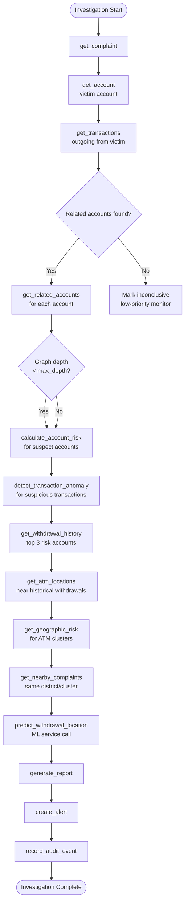

---

## 15. Tool Calling Flow

### Diagram C: Tool Calling Sequence

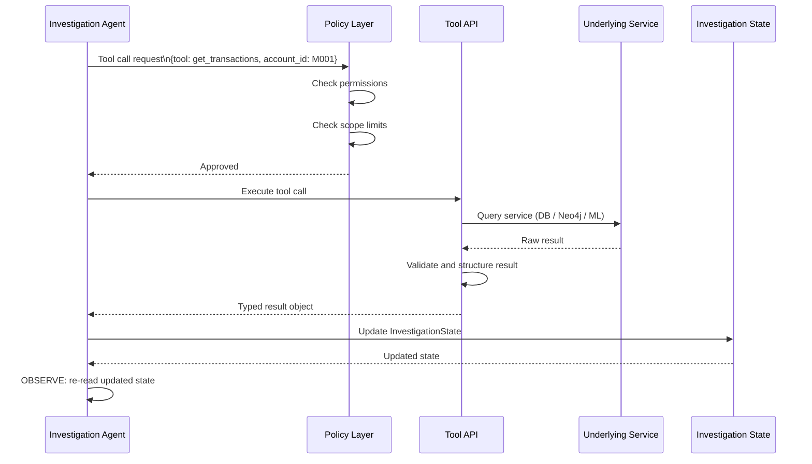

---

## 16. Multi-Hop Transaction Investigation

### Diagram C: Multi-Hop Transaction Traversal

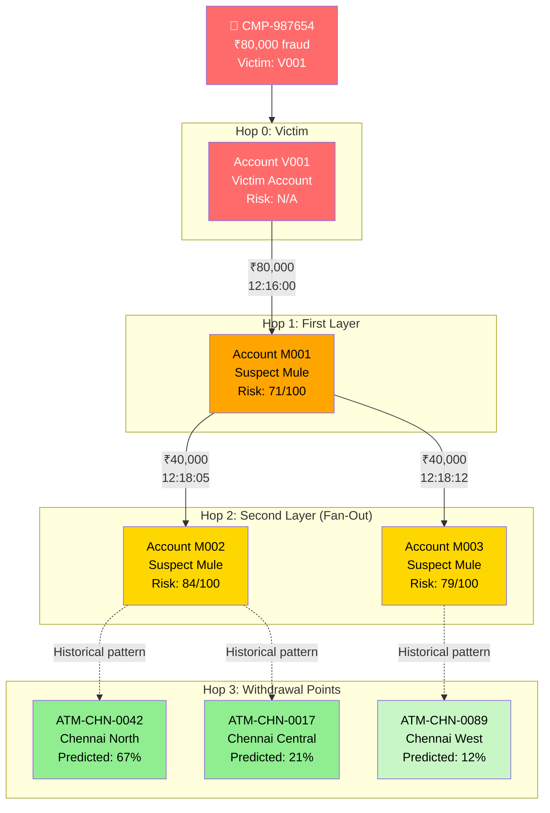

**Node labels:**
- 🔴 Red: Victim / complaint origin
- 🟠 Orange: Hop-1 mule accounts (directly receiving fraud funds)
- 🟡 Yellow: Hop-2 mule accounts (second-layer layering)
- 🟢 Green: Predicted withdrawal locations

**Traversal algorithm:**
1. Start at victim account (Hop 0)
2. Find all outgoing transactions within the fraud timeframe
3. For each destination account:
   a. Calculate account risk score
   b. Check for fan-out, structuring, round-amount flags
   c. If hop depth < max_depth: recurse for outgoing transactions
4. At each account: query withdrawal history
5. Aggregate withdrawal locations → geographic clustering → prediction input

---

## 17. Account Investigation

For each account encountered during traversal, the agent:

1. **Fetches account profile:** `get_account(account_id)`
   - Account type, bank, opening date, KYC score
2. **Fetches transactions:** `get_transactions(account_id, direction='all', window=24h)`
   - All transactions in the relevant time window
3. **Gets related accounts:** `get_related_accounts(account_id)`
   - Accounts sharing same phone, address, or device fingerprint
4. **Calculates risk:** `calculate_account_risk(account_id, features)`
   - Calls ML AccountRiskScorer → returns score 0–100
5. **Gets withdrawal history:** `get_withdrawal_history(account_id)`
   - Historical ATM withdrawals → geographic pattern

**Account flags raised by agent:**

| Flag | Trigger | Weight |
|---|---|---|
| `MULE_SUSPECT` | Account risk ≥ 70 | High |
| `STRUCTURING` | Multiple sub-threshold withdrawals | High |
| `FAN_OUT` | 5+ recipients within 1 hour | High |
| `ROUND_AMOUNT` | Transfer amount is round number | Medium |
| `RAPID_TRANSIT` | Funds in/out within 30 minutes | High |
| `LINKED_KNOWN_MULE` | Related account is confirmed mule | Critical |

---

## 18. Graph Traversal

The graph traversal is performed through the **Graph Service** (Neo4j), not by the LLM directly.

**Traversal parameters sent by agent:**
```json
{
  "start_account": "V001",
  "max_depth": 5,
  "max_accounts": 50,
  "time_window_start": "2024-01-15T12:00:00Z",
  "time_window_end": "2024-01-15T18:00:00Z",
  "min_amount": 1000,
  "traversal_type": "outgoing_only"
}
```

**Graph service returns:**
```json
{
  "nodes": [{"id": "V001", "type": "victim"}, {"id": "M001", "type": "suspect"}, ...],
  "edges": [{"from": "V001", "to": "M001", "amount": 80000, "timestamp": "..."}],
  "suspicious_paths": [
    {
      "path": ["V001", "M001", "M002"],
      "flags": ["RAPID_TRANSIT", "FAN_OUT"],
      "depth": 2
    }
  ],
  "depth_reached": 2,
  "accounts_explored": 3
}
```

---

## 19. ATM Investigation

Once withdrawal history is retrieved for suspect accounts, the agent investigates ATMs:

1. **Get ATM locations:** `get_atm_locations(account_id)` — returns ATMs where this account has withdrawn
2. **Get ATM risk:** `get_atm_risk(atm_id)` — returns historical fraud association score for the ATM
3. **Identify clusters:** Agent uses `get_geographic_risk(lat, lon, radius_km)` to identify risk zone

**ATM data structure:**
```json
{
  "atm_id": "ATM-CHN-0042",
  "location": {"lat": 13.0827, "lon": 80.2707},
  "bank": "SBI",
  "district": "Chennai North",
  "historical_fraud_count": 12,
  "historical_fraud_score": 0.74,
  "last_known_incident": "2024-01-10T15:30:00Z"
}
```

---

## 20. Geospatial Investigation

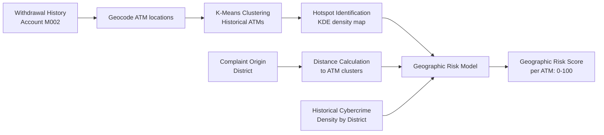

The Geospatial Engine produces:
- **Top-K candidate ATMs** (ranked by geographic risk score)
- **Risk zone polygon** (for map visualization)
- **Time-window estimate** (based on historical withdrawal timing patterns)

---

## 21. ML Model Interaction

### Diagram D: Agent → Tools → ML Workflow

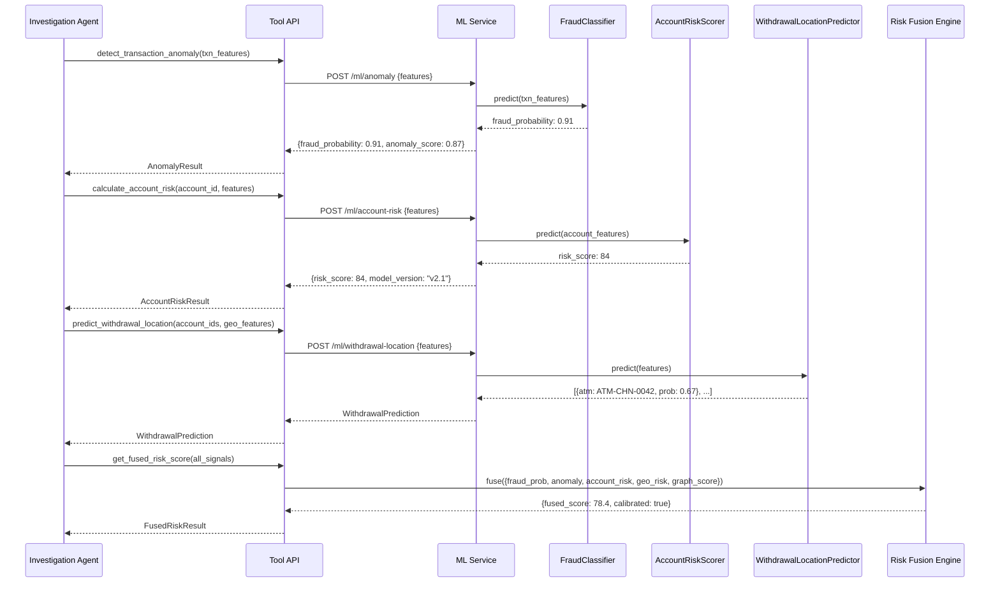

**Critical rule enforced in agent code:**
```python
# The agent NEVER does this:
risk_score = llm.ask("what is the risk score?")  # WRONG

# The agent ALWAYS does this:
risk_score = tools.calculate_account_risk(account_id, features)  # CORRECT
```

---

## 22. Risk Engine Interaction

The Risk Fusion Engine is called once all individual ML scores are available:

**Input to Risk Fusion Engine:**
```json
{
  "investigation_id": "INV-001",
  "signals": {
    "fraud_classifier_score": 0.91,
    "anomaly_score": 0.87,
    "account_risk_score": 84,
    "graph_suspicion_score": 72,
    "geographic_risk_score": 68,
    "temporal_pattern_score": 0.65
  },
  "metadata": {
    "graph_depth": 2,
    "accounts_investigated": 3,
    "flags": ["FAN_OUT", "RAPID_TRANSIT", "ROUND_AMOUNT"]
  }
}
```

**Output from Risk Fusion Engine:**
```json
{
  "fused_risk_score": 78.4,
  "risk_level": "HIGH",
  "calibrated_probability": 0.82,
  "confidence_interval": [0.71, 0.89],
  "component_weights": {
    "fraud_classifier": 0.25,
    "anomaly_detector": 0.20,
    "account_risk_scorer": 0.20,
    "graph_score": 0.15,
    "geographic_risk": 0.15,
    "temporal_score": 0.05
  }
}
```

---

## 23. Alert Generation

### Diagram F: Alert Workflow

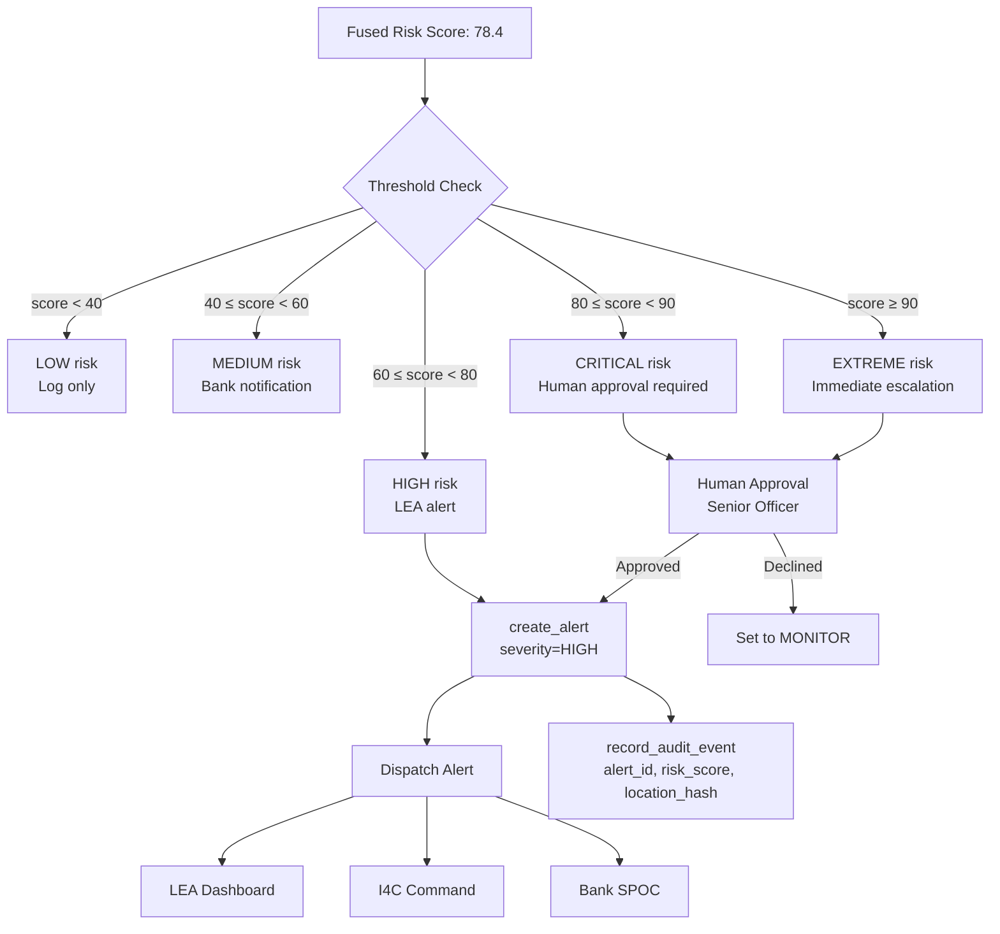

---

## 24. Human Escalation

### Diagram H: Human-in-the-Loop Workflow

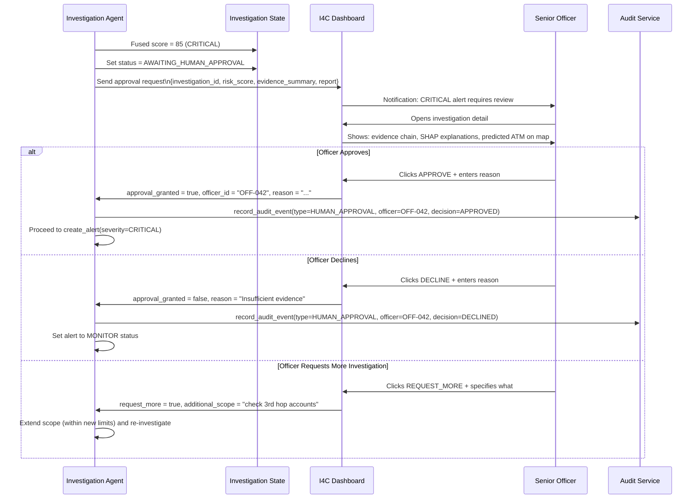

---

## 25. Feedback Loop

### Diagram I: Complete End-to-End Investigation with Feedback

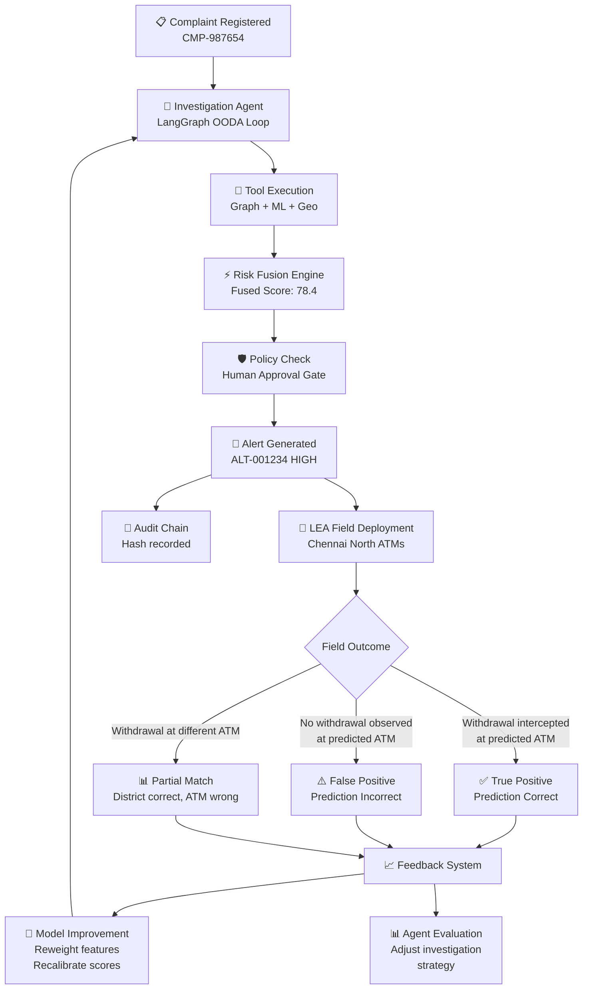

**Feedback data captured per outcome:**

| Field | Description |
|---|---|
| `prediction_id` | Which prediction was made |
| `predicted_atm_id` | Predicted ATM |
| `actual_atm_id` | Actual withdrawal ATM (if any) |
| `actual_occurred` | Boolean — did withdrawal occur? |
| `lead_time_minutes` | How many minutes before actual withdrawal |
| `officer_notes` | Free-text outcome notes |
| `recorded_by` | Officer ID |
| `recorded_at` | Timestamp |

This feedback feeds directly into:
1. **Periodic model retraining** (weekly or on-demand)
2. **Risk fusion weight adjustment** (quarterly)
3. **Agent strategy improvement** (prompt/policy updates)
4. **Geographic pattern updating** (hotspot recalculation)

---

### Diagram E: Agent Decision Tree (Simplified)

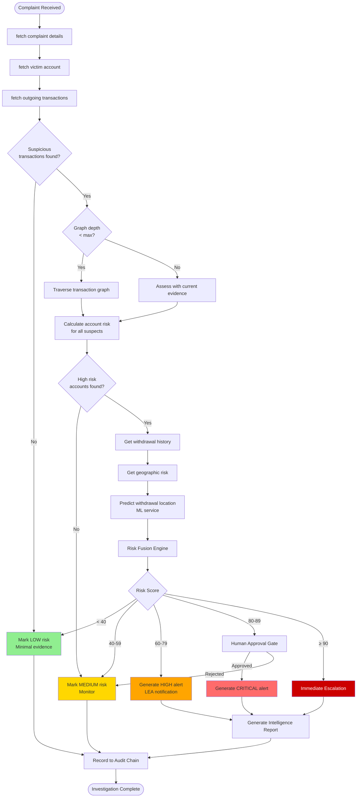

### Diagram G: Error / Retry Workflow

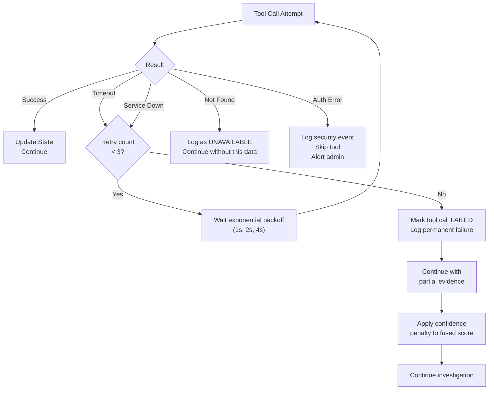

---

*Document version: 1.0 | PCCWIS — Problem Statement ID 26184*
