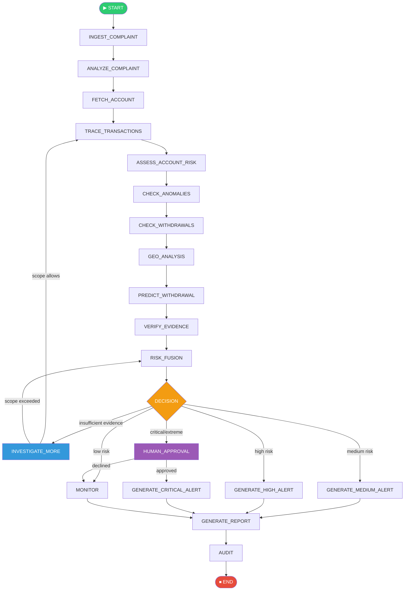
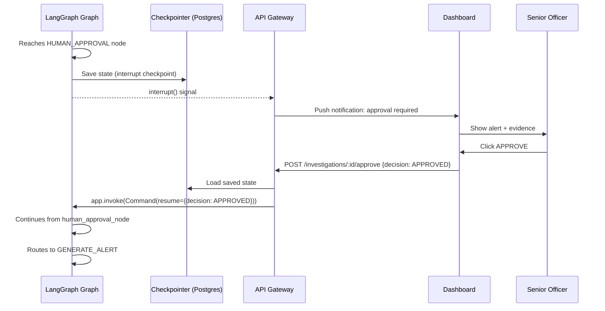
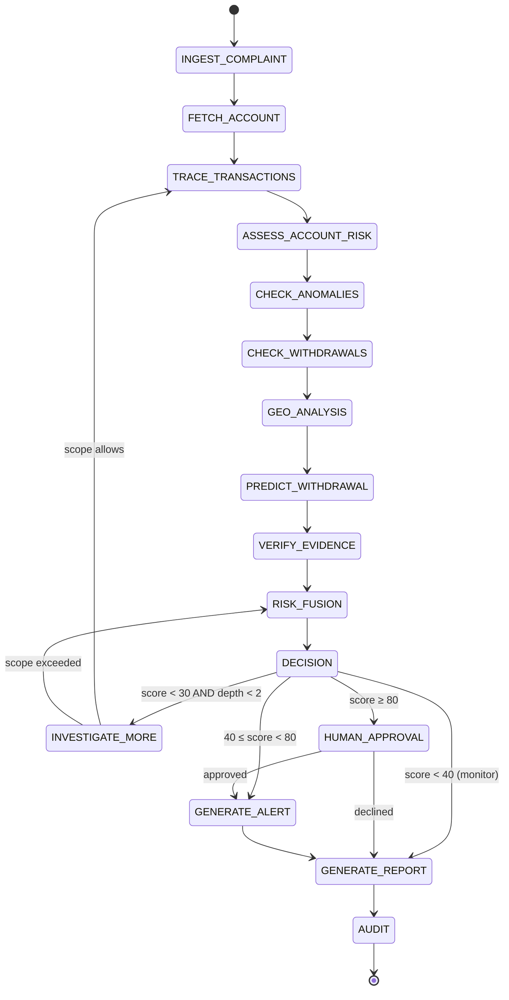
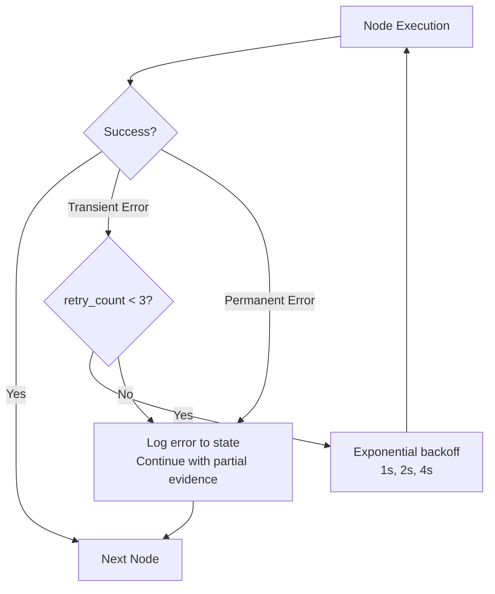

# LangGraph Architecture Overview

> **PCCWIS — LangGraph-based Investigation Agent Architecture**
> Predictive Cybercrime Cash Withdrawal Intelligence System

---

## Table of Contents

1. [Why LangGraph?](#1-why-langgraph)
2. [LangGraph Core Concepts](#2-langgraph-core-concepts)
3. [Investigation StateGraph Design](#3-investigation-stategraph-design)
4. [State Schema](#4-state-schema)
5. [Nodes](#5-nodes)
6. [Edges and Conditional Routing](#6-edges-and-conditional-routing)
7. [Checkpointing and Persistence](#7-checkpointing-and-persistence)
8. [Tool Nodes](#8-tool-nodes)
9. [Human-in-the-Loop](#9-human-in-the-loop)
10. [Retry Logic](#10-retry-logic)
11. [Timeouts and Maximum Recursion](#11-timeouts-and-maximum-recursion)
12. [Observability](#12-observability)
13. [Production Considerations](#13-production-considerations)
14. [Conceptual Python Implementation](#14-conceptual-python-implementation)
15. [Diagrams](#15-diagrams)

---

## 1. Why LangGraph?

### 1.1 The Problem With Simple LLM Chains

A naive implementation of an investigation agent might look like:

```python
# NAIVE — Single chain, no state, no control
response = llm.chain([
    "Complaint: {complaint}",
    "Investigate this and predict where withdrawal will happen"
])
```

This is insufficient because:
1. The LLM cannot actually access databases, ML models, or graph tools
2. Investigation requires 10–20 sequential + conditional steps
3. State must persist across all steps
4. Some paths depend on what was found in earlier steps
5. Human approval must pause and resume the flow
6. Scope limits must be enforced
7. Retries must be handled at node level

### 1.2 Why LangGraph Specifically

| Requirement | LangGraph Solution |
|---|---|
| **Stateful multi-step flows** | `TypedDict`/`Pydantic` state passed through the graph |
| **Conditional branching** | Conditional edges with routing functions |
| **Human-in-the-loop** | `interrupt()` primitive for mid-graph pause |
| **Persistence** | Pluggable checkpointers (Redis, PostgreSQL) |
| **Cycles** | Explicit support for loops (unlike DAG-only frameworks) |
| **Parallel execution** | `fan_out` for parallel tool calls |
| **Observability** | Built-in tracing with LangSmith |
| **Maximum recursion** | `recursion_limit` parameter |
| **Production-grade** | Active development, Google/OpenAI integrations |

LangGraph is purpose-built for **cyclical, stateful, multi-agent workflows** — exactly what an investigation OODA loop requires.

---

## 2. LangGraph Core Concepts

### 2.1 StateGraph

A `StateGraph` is a directed graph (with possible cycles) where:
- **Nodes** are Python functions that read and update state
- **Edges** define transitions between nodes
- **Conditional edges** choose the next node based on state

```python
from langgraph.graph import StateGraph, END

# Create a graph with our state type
graph = StateGraph(InvestigationState)
```

### 2.2 State

State is a `TypedDict` or Pydantic model that is passed through every node. Each node receives the full state and returns only the keys it modified.

```python
class InvestigationState(TypedDict):
    complaint_id: str
    complaint: Optional[dict]
    accounts: list[dict]
    # ... all other state fields
```

### 2.3 Nodes

A node is a Python function:

```python
def fetch_account_node(state: InvestigationState) -> dict:
    """Fetch victim account and return state updates"""
    account = get_account(state["complaint"]["victim_account_id"])
    return {
        "victim_account": account,
        "tool_calls_made": state["tool_calls_made"] + 1
    }
```

Nodes return **partial state updates** (only the keys that changed), not the full state.

### 2.4 Edges

Edges connect nodes:

```python
graph.add_edge("fetch_account", "trace_transactions")  # Unconditional
graph.add_conditional_edges(               # Conditional
    "decision",
    route_by_risk,
    {"alert": "generate_alert", "monitor": END}
)
```

---

## 3. Investigation StateGraph Design

### 3.1 Complete Graph



---

## 4. State Schema

```python
from typing import TypedDict, Optional, Annotated
from operator import add

class InvestigationState(TypedDict):
    """Complete state for one PCCWIS investigation run.
    
    IMPORTANT:
    - Fields marked with Annotated[list, add] are append-only (LangGraph merges them)
    - Other fields are overwritten on each update
    """

    # --- Identifiers ---
    investigation_id: str
    complaint_id: str
    agent_run_id: str

    # --- Configuration (set at init, never changed) ---
    max_graph_depth: int
    max_tool_calls: int
    max_accounts_investigated: int
    max_investigation_time_minutes: int

    # --- Progress ---
    tool_calls_made: int
    graph_depth_reached: int
    investigation_status: str  # IN_PROGRESS / AWAITING_HUMAN / COMPLETE / FAILED / ABORTED

    # --- Accumulated evidence (append-only fields) ---
    accounts_investigated: Annotated[list[str], add]        # List of account IDs
    traced_transactions: Annotated[list[dict], add]         # Transaction records
    flags_raised: Annotated[list[str], add]                 # Fraud flags
    tool_call_log: Annotated[list[dict], add]               # Tool call history

    # --- Complaint data ---
    complaint: Optional[dict]
    victim_account: Optional[dict]

    # --- Suspect accounts ---
    suspect_accounts: list[dict]

    # --- ML results ---
    account_risk_scores: dict[str, float]     # account_id -> risk score
    fraud_probabilities: dict[str, float]     # txn_id -> fraud probability
    anomaly_scores: dict[str, float]          # account_id -> anomaly score

    # --- Geographic data ---
    withdrawal_history: list[dict]
    atm_locations: list[dict]
    geographic_risk_scores: dict[str, float]  # atm_id -> geo risk

    # --- Prediction ---
    withdrawal_prediction: Optional[dict]
    fused_risk_score: Optional[float]
    risk_level: Optional[str]
    calibrated_probability: Optional[float]

    # --- Outputs ---
    report: Optional[str]
    report_id: Optional[str]
    alert_id: Optional[str]

    # --- Human approval ---
    human_approval_required: bool
    human_approval_status: Optional[str]   # APPROVED / DECLINED / PENDING
    approver_id: Optional[str]
    approval_notes: Optional[str]

    # --- Error tracking ---
    errors: Annotated[list[dict], add]
    retry_counts: dict[str, int]           # tool_name -> retry count
```

---

## 5. Nodes

Each node is a pure function: `(state) → state_updates`.

### 5.1 INGEST_COMPLAINT

```python
from langchain_core.tools import tool

def ingest_complaint_node(state: InvestigationState) -> dict:
    """
    Node: INGEST_COMPLAINT
    Purpose: Fetch and parse the complaint record
    """
    complaint_id = state["complaint_id"]
    
    try:
        complaint = tools.get_complaint(complaint_id)
        return {
            "complaint": complaint.dict(),
            "tool_calls_made": state["tool_calls_made"] + 1,
            "tool_call_log": [{
                "tool": "get_complaint",
                "input": {"complaint_id": complaint_id},
                "status": "SUCCESS",
                "timestamp": datetime.now().isoformat()
            }]
        }
    except Exception as e:
        return {
            "errors": [{"node": "INGEST_COMPLAINT", "error": str(e)}],
            "investigation_status": "FAILED"
        }
```

### 5.2 ANALYZE_COMPLAINT

```python
def analyze_complaint_node(state: InvestigationState) -> dict:
    """
    Node: ANALYZE_COMPLAINT
    Purpose: LLM analyzes complaint metadata to set investigation priorities
    
    NOTE: LLM only performs ANALYSIS here — no risk scores, no predictions.
    """
    complaint = state["complaint"]
    
    # LLM analyzes the complaint for investigation strategy
    analysis_prompt = f"""
    Analyze this cybercrime complaint and extract:
    1. Key entities (victim account, fraud type, amount)
    2. Investigation priority indicators
    3. Suggested investigation sequence
    
    Complaint: {json.dumps(complaint)}
    
    Return a structured analysis JSON with fields:
    - entities: dict
    - priority_factors: list
    - suggested_sequence: list of tool names
    """
    
    analysis = llm.invoke(analysis_prompt, response_format=ComplaintAnalysis)
    
    return {
        "complaint_analysis": analysis.dict(),
        "tool_calls_made": state["tool_calls_made"] + 1
    }
```

### 5.3 FETCH_ACCOUNT

```python
def fetch_account_node(state: InvestigationState) -> dict:
    """Node: FETCH_ACCOUNT — Get victim account profile"""
    victim_id = state["complaint"]["victim_account_id"]
    
    account = tools.get_account(victim_id)
    return {
        "victim_account": account.dict(),
        "accounts_investigated": [victim_id],
        "tool_calls_made": state["tool_calls_made"] + 1
    }
```

### 5.4 TRACE_TRANSACTIONS

```python
def trace_transactions_node(state: InvestigationState) -> dict:
    """
    Node: TRACE_TRANSACTIONS
    Multi-hop transaction graph traversal
    """
    # Check scope limit before starting
    if state["graph_depth_reached"] >= state["max_graph_depth"]:
        return {"flags_raised": ["MAX_DEPTH_REACHED"]}
    
    victim_id = state["complaint"]["victim_account_id"]
    fraud_time = state["complaint"]["reported_at"]
    
    # Call graph traversal tool (NOT LLM — this is a graph query)
    graph_result = tools.trace_transaction_graph(
        start_account_id=victim_id,
        max_depth=state["max_graph_depth"],
        max_accounts=state["max_accounts_investigated"],
        time_window_hours=24
    )
    
    # Extract new accounts to investigate
    new_accounts = [
        node["id"] for node in graph_result.nodes 
        if node["type"] != "victim"
        and node["id"] not in state["accounts_investigated"]
    ]
    
    return {
        "traced_transactions": graph_result.edges,
        "suspect_accounts": graph_result.nodes,
        "flags_raised": [f for path in graph_result.suspicious_paths for f in path["flags"]],
        "graph_depth_reached": graph_result.depth_reached,
        "accounts_investigated": new_accounts,
        "tool_calls_made": state["tool_calls_made"] + 1
    }
```

### 5.5 ASSESS_ACCOUNT_RISK

```python
def assess_account_risk_node(state: InvestigationState) -> dict:
    """
    Node: ASSESS_ACCOUNT_RISK
    Calls ML service to compute risk score for all suspect accounts.
    
    CRITICAL: Risk scores come from ML models, NOT from LLM.
    """
    risk_scores = {}
    tool_calls = 0
    
    for account in state["suspect_accounts"]:
        if account["type"] == "victim":
            continue
        if tool_calls + state["tool_calls_made"] >= state["max_tool_calls"]:
            break
        
        # Build feature vector (deterministic feature engineering)
        features = feature_engineering.build_account_features(
            account_id=account["id"],
            transactions=state["traced_transactions"]
        )
        
        # Call ML service — NOT LLM
        risk_result = tools.calculate_account_risk(
            account_id=account["id"],
            features=features
        )
        
        risk_scores[account["id"]] = risk_result.risk_score
        tool_calls += 1
    
    return {
        "account_risk_scores": risk_scores,
        "tool_calls_made": state["tool_calls_made"] + tool_calls
    }
```

### 5.6 PREDICT_WITHDRAWAL

```python
def predict_withdrawal_node(state: InvestigationState) -> dict:
    """
    Node: PREDICT_WITHDRAWAL
    Calls ML WithdrawalLocationPredictor.
    
    CRITICAL: Prediction comes from ML model, NOT from LLM.
    """
    # Only call for high-risk accounts
    high_risk_accounts = [
        acc_id for acc_id, score in state["account_risk_scores"].items()
        if score >= 60
    ]
    
    if not high_risk_accounts:
        return {"withdrawal_prediction": None}
    
    # Build feature vector for prediction
    features = feature_engineering.build_withdrawal_prediction_features(
        account_ids=high_risk_accounts,
        withdrawal_history=state["withdrawal_history"],
        geographic_data=state["geographic_risk_scores"],
        complaint=state["complaint"]
    )
    
    # Call ML service — NOT LLM
    prediction = tools.predict_withdrawal_location(
        account_ids=high_risk_accounts,
        investigation_id=state["investigation_id"],
        features=features
    )
    
    return {
        "withdrawal_prediction": prediction.dict(),
        "tool_calls_made": state["tool_calls_made"] + 1
    }
```

### 5.7 RISK_FUSION

```python
def risk_fusion_node(state: InvestigationState) -> dict:
    """
    Node: RISK_FUSION
    Calls Risk Fusion Engine to produce calibrated risk score.
    Deterministic weighted combination — NOT LLM judgment.
    """
    if not state.get("account_risk_scores"):
        return {"fused_risk_score": 0.0, "risk_level": "LOW"}
    
    # Build signals dict for fusion engine
    signals = {
        "account_risk_score": max(state["account_risk_scores"].values(), default=0),
        "anomaly_score": max(state.get("anomaly_scores", {}).values(), default=0),
        "fraud_probability": max(state.get("fraud_probabilities", {}).values(), default=0),
        "geographic_risk": max(state.get("geographic_risk_scores", {}).values(), default=0),
        "graph_suspicion": compute_graph_suspicion_score(state["flags_raised"]),
        "withdrawal_confidence": (
            state["withdrawal_prediction"]["confidence"] 
            if state.get("withdrawal_prediction") else 0
        )
    }
    
    # Call Risk Fusion Engine (deterministic weighted formula)
    fusion_result = risk_fusion_engine.fuse(signals)
    
    return {
        "fused_risk_score": fusion_result["fused_score"],
        "risk_level": fusion_result["risk_level"],
        "calibrated_probability": fusion_result["calibrated_probability"]
    }
```

### 5.8 DECISION

```python
def decision_node(state: InvestigationState) -> dict:
    """
    Node: DECISION
    Deterministic routing based on risk score.
    The LLM does NOT make this decision — thresholds do.
    """
    score = state.get("fused_risk_score", 0)
    
    # Determine if more investigation is needed
    if score < 30 and state["graph_depth_reached"] < 2:
        return {"decision_outcome": "investigate_more"}
    elif score < 40:
        return {"decision_outcome": "monitor"}
    elif score < 60:
        return {"decision_outcome": "medium_alert"}
    elif score < 80:
        return {"decision_outcome": "high_alert"}
    elif score < 90:
        return {"decision_outcome": "critical_alert", "human_approval_required": True}
    else:
        return {"decision_outcome": "extreme_alert", "human_approval_required": True}
```

### 5.9 HUMAN_APPROVAL

```python
def human_approval_node(state: InvestigationState) -> dict:
    """
    Node: HUMAN_APPROVAL
    Pauses the graph and waits for officer input.
    Uses LangGraph's interrupt() mechanism.
    """
    from langgraph.types import interrupt
    
    # interrupt() pauses the graph here until resumed
    # The dashboard will show the approval UI to the officer
    approval_response = interrupt({
        "message": "Critical risk detected. Officer approval required.",
        "investigation_id": state["investigation_id"],
        "risk_score": state["fused_risk_score"],
        "evidence_summary": summarize_evidence(state),
        "predicted_location": state["withdrawal_prediction"]
    })
    
    # When resumed, approval_response contains the officer's decision
    return {
        "human_approval_status": approval_response.get("decision"),
        "approver_id": approval_response.get("officer_id"),
        "approval_notes": approval_response.get("notes")
    }
```

### 5.10 GENERATE_REPORT

```python
def generate_report_node(state: InvestigationState) -> dict:
    """
    Node: GENERATE_REPORT
    LLM generates human-readable intelligence report from structured state.
    
    This IS an appropriate use of LLM — writing prose from structured data.
    """
    # Prepare structured summary for LLM (LLM does NOT access raw DB)
    evidence_summary = {
        "complaint_id": state["complaint_id"],
        "fraud_amount": state["complaint"]["fraud_amount"],
        "accounts_investigated": len(state["accounts_investigated"]),
        "flags_raised": state["flags_raised"],
        "risk_scores": state["account_risk_scores"],
        "top_predicted_atm": (
            state["withdrawal_prediction"]["predictions"][0] 
            if state.get("withdrawal_prediction") else None
        ),
        "fused_risk_score": state["fused_risk_score"]
    }
    
    report_text = llm.invoke(
        f"""Write a concise intelligence report for law enforcement.
        
        Evidence: {json.dumps(evidence_summary)}
        
        Rules:
        - Do not invent facts not in the evidence
        - Always state: "This is probabilistic intelligence, not certainty"
        - Recommend specific action (Monitor / Deploy to area / Escalate)
        - Keep under 400 words
        - Write for a law enforcement audience
        """
    )
    
    # Save report to database
    report_id = db.save_report(state["investigation_id"], report_text)
    
    return {
        "report": report_text,
        "report_id": report_id
    }
```

### 5.11 AUDIT

```python
def audit_node(state: InvestigationState) -> dict:
    """
    Node: AUDIT
    Records final audit chain entry and closes investigation.
    """
    # Get current chain head
    chain = audit_service.get_chain(state["investigation_id"])
    previous_hash = chain.head_hash if chain else "genesis"
    
    # Record investigation completion
    audit_result = tools.record_audit_event(
        investigation_id=state["investigation_id"],
        event_type="INVESTIGATION_COMPLETE",
        event_data={
            "complaint_id": state["complaint_id"],
            "risk_score": state["fused_risk_score"],
            "alert_id": state.get("alert_id"),
            "report_id": state.get("report_id"),
            "tool_calls_made": state["tool_calls_made"],
            "outcome": state["investigation_status"]
        },
        previous_hash=previous_hash
    )
    
    return {
        "investigation_status": "COMPLETE"
    }
```

---

## 6. Edges and Conditional Routing

### 6.1 Routing Function for DECISION Node

```python
def route_by_risk_level(state: InvestigationState) -> str:
    """
    Conditional routing function for DECISION node.
    Returns the name of the next node based on state.
    
    This is DETERMINISTIC — not LLM-based.
    """
    outcome = state.get("decision_outcome", "monitor")
    
    routing_map = {
        "investigate_more": "INVESTIGATE_MORE",
        "monitor": "GENERATE_REPORT",        # Low risk → just report
        "medium_alert": "GENERATE_ALERT",
        "high_alert": "GENERATE_ALERT",
        "critical_alert": "HUMAN_APPROVAL",
        "extreme_alert": "HUMAN_APPROVAL"
    }
    
    return routing_map.get(outcome, "GENERATE_REPORT")
```

### 6.2 Routing Function After Human Approval

```python
def route_after_human_approval(state: InvestigationState) -> str:
    approval = state.get("human_approval_status", "DECLINED")
    if approval == "APPROVED":
        return "GENERATE_ALERT"
    else:
        return "GENERATE_REPORT"  # Declined → just monitor report
```

### 6.3 Routing Function for INVESTIGATE_MORE

```python
def route_from_investigate_more(state: InvestigationState) -> str:
    """
    After deciding to investigate more, check if scope allows.
    """
    scope_ok = (
        state["tool_calls_made"] < state["max_tool_calls"] and
        state["graph_depth_reached"] < state["max_graph_depth"] and
        len(state["accounts_investigated"]) < state["max_accounts_investigated"]
    )
    
    if scope_ok:
        return "TRACE_TRANSACTIONS"  # Loop back for more investigation
    else:
        return "RISK_FUSION"         # Must work with what we have
```

---

## 7. Checkpointing and Persistence

### 7.1 Why Checkpointing

Checkpointing allows:
1. **Recovery:** If the agent crashes mid-investigation, it can resume from last saved state
2. **Human-in-the-loop:** The graph can pause at `interrupt()` and persist state until officer responds
3. **Debugging:** Full investigation history can be replayed step-by-step
4. **Audit:** Every state transition is stored and retrievable

### 7.2 PostgreSQL Checkpointer

```python
from langgraph.checkpoint.postgres import PostgresSaver

# Configure PostgreSQL checkpointer
checkpointer = PostgresSaver.from_conn_string(
    conn_string=os.environ["POSTGRES_URL"]
)

# Compile graph with checkpointer
app = graph.compile(checkpointer=checkpointer)
```

### 7.3 Thread ID = Investigation ID

Each investigation is a separate "thread" in LangGraph terminology:

```python
# Start investigation
config = {"configurable": {"thread_id": investigation_id}}
result = app.invoke(initial_state, config=config)

# Resume after human approval
app.invoke(
    {"human_approval_status": "APPROVED", "approver_id": "OFF-042"},
    config=config  # Same thread_id — continues from where it paused
)

# Inspect any past state
history = list(app.get_state_history(config))
```

---

## 8. Tool Nodes

LangGraph supports first-class tool nodes that handle tool calling automatically:

```python
from langgraph.prebuilt import ToolNode

# Define tools as LangChain tools
@tool
def get_account(account_id: str) -> dict:
    """Fetch account profile from database"""
    return db.fetch_account(account_id)

@tool
def calculate_account_risk(account_id: str) -> dict:
    """Calculate ML-based risk score for account (calls ML service)"""
    return ml_service.account_risk(account_id)

# Create tool node
investigation_tools = [get_account, calculate_account_risk, ...]
tool_node = ToolNode(investigation_tools)

# Add to graph
graph.add_node("tools", tool_node)
```

Tool nodes automatically:
- Parse tool calls from LLM messages
- Execute the tool function
- Return results as `ToolMessage`
- Handle errors gracefully

---

## 9. Human-in-the-Loop

### 9.1 The interrupt() Pattern

```python
# In the graph node:
from langgraph.types import interrupt

def human_approval_node(state):
    # This pauses the graph execution
    # Returns to caller with interrupt signal
    response = interrupt({
        "type": "human_approval_required",
        "risk_score": state["fused_risk_score"],
        "summary": state["evidence_summary"]
    })
    # Execution resumes here after app.invoke() is called again with the response
    return {"human_approval_status": response["decision"]}
```

### 9.2 API Integration for Human Approval

```python
# FastAPI endpoint to resume a paused investigation
@router.post("/api/v1/investigations/{investigation_id}/approve")
async def approve_investigation(
    investigation_id: str,
    body: ApprovalRequest,
    user: User = Depends(require_role("senior_officer"))
):
    config = {"configurable": {"thread_id": investigation_id}}
    
    # Record audit event
    audit_service.record(investigation_id, "HUMAN_APPROVAL", {
        "officer_id": user.id,
        "decision": body.decision
    })
    
    # Resume the LangGraph investigation
    result = app.invoke(
        Command(resume={
            "decision": body.decision,
            "officer_id": user.id,
            "notes": body.notes
        }),
        config=config
    )
    
    return {"status": "resumed", "investigation_id": investigation_id}
```

### 9.3 Approval Diagram



---

## 10. Retry Logic

### 10.1 Node-Level Retry

```python
def fetch_account_node(state: InvestigationState) -> dict:
    account_id = state["complaint"]["victim_account_id"]
    tool_name = "get_account"
    
    retry_count = state.get("retry_counts", {}).get(tool_name, 0)
    
    try:
        account = tools.get_account(account_id)
        return {"victim_account": account.dict(), "tool_calls_made": state["tool_calls_made"] + 1}
    
    except TemporaryServiceError as e:
        if retry_count < 3:
            time.sleep(2 ** retry_count)  # Exponential backoff
            return {
                "retry_counts": {**state.get("retry_counts", {}), tool_name: retry_count + 1}
            }
        else:
            # Permanent failure — log and continue
            return {
                "errors": [{"node": "FETCH_ACCOUNT", "error": str(e), "account_id": account_id}],
                "victim_account": None
            }
```

### 10.2 Routing Around Failed Nodes

```python
def route_after_fetch_account(state: InvestigationState) -> str:
    if state.get("victim_account") is None:
        # Account fetch failed — skip to report with error state
        return "GENERATE_REPORT"
    return "TRACE_TRANSACTIONS"
```

---

## 11. Timeouts and Maximum Recursion

### 11.1 Maximum Recursion

LangGraph enforces a recursion limit to prevent infinite loops:

```python
app = graph.compile(
    checkpointer=checkpointer,
    recursion_limit=50  # Maximum number of node executions per investigation
)
```

**Recommended limit for PCCWIS:** 50 (generous but bounded)

### 11.2 Investigation Time Limit

```python
def check_time_limit_node(state: InvestigationState) -> dict:
    """Check if investigation has exceeded time limit"""
    started = datetime.fromisoformat(state["started_at"])
    elapsed_minutes = (datetime.now() - started).total_seconds() / 60
    
    if elapsed_minutes >= state["max_investigation_time_minutes"]:
        return {
            "flags_raised": ["INVESTIGATION_TIMEOUT"],
            "investigation_status": "TIMEOUT"
        }
    return {}
```

### 11.3 Timeouts on External Calls

```python
import httpx

async def call_ml_service(endpoint: str, payload: dict) -> dict:
    """Call ML service with timeout"""
    async with httpx.AsyncClient(timeout=10.0) as client:  # 10 second timeout
        try:
            response = await client.post(f"http://ml-service:8002{endpoint}", json=payload)
            response.raise_for_status()
            return response.json()
        except httpx.TimeoutException:
            raise ToolTimeoutError(f"ML service timed out: {endpoint}")
```

---

## 12. Observability

### 12.1 LangSmith Tracing

```python
import os
os.environ["LANGCHAIN_TRACING_V2"] = "true"
os.environ["LANGCHAIN_API_KEY"] = os.environ["LANGSMITH_API_KEY"]
os.environ["LANGCHAIN_PROJECT"] = "pccwis-investigations"

# All LangGraph runs are automatically traced in LangSmith
# Each investigation = one trace with all node executions, LLM calls, tool results
```

### 12.2 Custom Structured Logging

```python
import structlog

logger = structlog.get_logger()

def log_node_entry(node_name: str, state: InvestigationState):
    logger.info(
        "node_started",
        node=node_name,
        investigation_id=state["investigation_id"],
        tool_calls=state["tool_calls_made"],
        graph_depth=state["graph_depth_reached"]
    )

def log_node_exit(node_name: str, state_updates: dict, duration_ms: int):
    logger.info(
        "node_completed",
        node=node_name,
        updated_keys=list(state_updates.keys()),
        duration_ms=duration_ms
    )
```

### 12.3 Metrics (Prometheus)

```python
from prometheus_client import Counter, Histogram, Gauge

investigation_counter = Counter("investigations_total", "Total investigations", ["status"])
node_duration = Histogram("node_duration_seconds", "Node execution time", ["node_name"])
active_investigations = Gauge("active_investigations", "Currently running investigations")
```

---

## 13. Production Considerations

### 13.1 Async Execution

All nodes should be async in production:

```python
async def fetch_account_node(state: InvestigationState) -> dict:
    account = await tools_async.get_account(state["complaint"]["victim_account_id"])
    return {"victim_account": account.dict()}
```

### 13.2 Parallel Tool Calls

For independent calls (e.g., risk scores for multiple accounts), use parallel execution:

```python
from langgraph.types import Send

def send_parallel_risk_assessments(state: InvestigationState):
    """Fan-out: send each suspect account to parallel risk assessment"""
    return [
        Send("ASSESS_SINGLE_ACCOUNT", {"account_id": acc["id"], **state})
        for acc in state["suspect_accounts"]
        if acc["type"] != "victim"
    ]

graph.add_conditional_edges(
    "TRACE_TRANSACTIONS",
    send_parallel_risk_assessments
)
```

### 13.3 Error Recovery

```python
# Compile with interrupt_before for debugging
app_debug = graph.compile(
    checkpointer=checkpointer,
    interrupt_before=["PREDICT_WITHDRAWAL"]  # Always pause before prediction
)
```

### 13.4 Graph Versioning

When the investigation graph changes, old in-progress investigations must continue on the previous graph version:

```python
# Store graph version in investigation state
config = {
    "configurable": {
        "thread_id": investigation_id,
        "graph_version": "v1.2"
    }
}
```

---

## 14. Conceptual Python Implementation

Complete implementation of the PCCWIS LangGraph investigation agent:

```python
"""
PCCWIS Investigation Agent — LangGraph Implementation
Conceptual code for learning/reference purposes.
"""

import json
from datetime import datetime
from typing import Annotated, Optional, TypedDict
from operator import add

from langchain_google_genai import ChatGoogleGenerativeAI
from langgraph.graph import StateGraph, END
from langgraph.checkpoint.postgres import PostgresSaver
from langgraph.types import interrupt, Command

# ============================================================
# STATE DEFINITION
# ============================================================

class InvestigationState(TypedDict):
    investigation_id: str
    complaint_id: str
    started_at: str
    
    # Scope limits
    max_graph_depth: int
    max_tool_calls: int
    max_accounts_investigated: int
    
    # Progress
    tool_calls_made: int
    graph_depth_reached: int
    
    # Evidence (append-only)
    accounts_investigated: Annotated[list[str], add]
    flags_raised: Annotated[list[str], add]
    errors: Annotated[list[dict], add]
    tool_call_log: Annotated[list[dict], add]
    
    # Findings
    complaint: Optional[dict]
    victim_account: Optional[dict]
    suspect_accounts: list[dict]
    traced_transactions: list[dict]
    
    # ML results
    account_risk_scores: dict
    anomaly_scores: dict
    withdrawal_history: list[dict]
    geographic_risk_scores: dict
    withdrawal_prediction: Optional[dict]
    
    # Risk
    fused_risk_score: Optional[float]
    risk_level: Optional[str]
    decision_outcome: Optional[str]
    
    # Outputs
    report: Optional[str]
    alert_id: Optional[str]
    investigation_status: str
    
    # Human approval
    human_approval_required: bool
    human_approval_status: Optional[str]
    approver_id: Optional[str]


# ============================================================
# NODE IMPLEMENTATIONS
# ============================================================

llm = ChatGoogleGenerativeAI(model="gemini-1.5-pro")

def ingest_complaint_node(state: InvestigationState) -> dict:
    complaint = tools.get_complaint(state["complaint_id"])
    return {
        "complaint": complaint.dict(),
        "tool_calls_made": state["tool_calls_made"] + 1,
        "tool_call_log": [{"node": "ingest_complaint", "tool": "get_complaint", "status": "SUCCESS"}]
    }


def fetch_account_node(state: InvestigationState) -> dict:
    victim_id = state["complaint"]["victim_account_id"]
    account = tools.get_account(victim_id)
    return {
        "victim_account": account.dict(),
        "accounts_investigated": [victim_id],
        "tool_calls_made": state["tool_calls_made"] + 1
    }


def trace_transactions_node(state: InvestigationState) -> dict:
    graph_result = tools.trace_transaction_graph(
        start_account_id=state["complaint"]["victim_account_id"],
        max_depth=state["max_graph_depth"],
        max_accounts=state["max_accounts_investigated"]
    )
    new_accounts = [n["id"] for n in graph_result.nodes if n["type"] != "victim"]
    new_flags = list({f for p in graph_result.suspicious_paths for f in p["flags"]})
    return {
        "traced_transactions": graph_result.edges,
        "suspect_accounts": graph_result.nodes,
        "flags_raised": new_flags,
        "accounts_investigated": new_accounts,
        "graph_depth_reached": graph_result.depth_reached,
        "tool_calls_made": state["tool_calls_made"] + 1
    }


def assess_account_risk_node(state: InvestigationState) -> dict:
    """Calls ML service — NOT LLM — for numerical risk scores"""
    risk_scores = {}
    tool_calls = 0
    for acc in state["suspect_accounts"]:
        if acc["type"] == "victim": continue
        if state["tool_calls_made"] + tool_calls >= state["max_tool_calls"]: break
        features = feature_engineering.build_account_features(acc["id"], state)
        result = tools.calculate_account_risk(acc["id"], features)
        risk_scores[acc["id"]] = result.risk_score
        tool_calls += 1
    return {
        "account_risk_scores": risk_scores,
        "tool_calls_made": state["tool_calls_made"] + tool_calls
    }


def check_withdrawals_node(state: InvestigationState) -> dict:
    high_risk = [a for a, s in state["account_risk_scores"].items() if s >= 60]
    history = []
    for acc_id in high_risk[:3]:  # Top 3 high risk only
        wh = tools.get_withdrawal_history(acc_id)
        history.extend(wh.withdrawals)
    return {"withdrawal_history": history, "tool_calls_made": state["tool_calls_made"] + len(high_risk[:3])}


def geo_analysis_node(state: InvestigationState) -> dict:
    geo_scores = {}
    for wd in state["withdrawal_history"][:10]:
        atm_risk = tools.get_geographic_risk(lat=wd["lat"], lon=wd["lon"])
        geo_scores[wd["atm_id"]] = atm_risk.risk_score
    return {"geographic_risk_scores": geo_scores, "tool_calls_made": state["tool_calls_made"] + 1}


def predict_withdrawal_node(state: InvestigationState) -> dict:
    """Calls ML WithdrawalLocationPredictor — NOT LLM"""
    high_risk = [a for a, s in state["account_risk_scores"].items() if s >= 60]
    if not high_risk:
        return {"withdrawal_prediction": None}
    features = feature_engineering.build_withdrawal_features(high_risk, state)
    prediction = tools.predict_withdrawal_location(high_risk, state["investigation_id"], features)
    return {"withdrawal_prediction": prediction.dict(), "tool_calls_made": state["tool_calls_made"] + 1}


def verify_evidence_node(state: InvestigationState) -> dict:
    """Verify evidence coherence before fusion — can trigger more investigation"""
    has_suspects = len(state.get("suspect_accounts", [])) > 0
    has_risk_scores = len(state.get("account_risk_scores", {})) > 0
    has_prediction = state.get("withdrawal_prediction") is not None
    
    if has_suspects and has_risk_scores and has_prediction:
        return {"flags_raised": ["EVIDENCE_VERIFIED"]}
    elif not has_suspects:
        return {"flags_raised": ["NO_SUSPECTS_FOUND"], "decision_outcome": "monitor"}
    return {}


def risk_fusion_node(state: InvestigationState) -> dict:
    """Deterministic weighted fusion — NOT LLM"""
    scores = {
        "account_risk": max(state.get("account_risk_scores", {0: 0}).values()),
        "geographic_risk": max(state.get("geographic_risk_scores", {0: 0}).values()),
        "withdrawal_confidence": (
            state["withdrawal_prediction"]["confidence"] * 100
            if state.get("withdrawal_prediction") else 0
        ),
        "flag_score": min(len(state.get("flags_raised", [])) * 10, 30)
    }
    
    weights = {"account_risk": 0.35, "geographic_risk": 0.25, "withdrawal_confidence": 0.25, "flag_score": 0.15}
    fused = sum(scores[k] * weights[k] for k in scores)
    
    if fused >= 90: level = "EXTREME"
    elif fused >= 80: level = "CRITICAL"
    elif fused >= 60: level = "HIGH"
    elif fused >= 40: level = "MEDIUM"
    else: level = "LOW"
    
    return {"fused_risk_score": round(fused, 2), "risk_level": level}


def decision_node(state: InvestigationState) -> dict:
    """Deterministic threshold-based routing — NOT LLM"""
    score = state.get("fused_risk_score", 0)
    if score < 30 and state["graph_depth_reached"] < 2:
        outcome = "investigate_more"
    elif score < 40: outcome = "monitor"
    elif score < 60: outcome = "medium_alert"
    elif score < 80: outcome = "high_alert"
    elif score < 90: outcome = "critical_alert"
    else: outcome = "extreme_alert"
    
    return {
        "decision_outcome": outcome,
        "human_approval_required": outcome in ("critical_alert", "extreme_alert")
    }


def human_approval_node(state: InvestigationState) -> dict:
    response = interrupt({
        "message": "Critical risk — officer approval required",
        "investigation_id": state["investigation_id"],
        "risk_score": state["fused_risk_score"],
    })
    return {
        "human_approval_status": response.get("decision"),
        "approver_id": response.get("officer_id")
    }


def generate_alert_node(state: InvestigationState) -> dict:
    severity = state["risk_level"]
    alert = tools.create_alert(
        investigation_id=state["investigation_id"],
        severity=severity,
        risk_score=state["fused_risk_score"],
        withdrawal_prediction=state.get("withdrawal_prediction"),
        human_approved=state.get("human_approval_status") == "APPROVED"
    )
    return {"alert_id": alert.alert_id}


def generate_report_node(state: InvestigationState) -> dict:
    """LLM generates human-readable report from structured evidence"""
    summary = {
        "complaint_id": state["complaint_id"],
        "risk_score": state["fused_risk_score"],
        "flags": state["flags_raised"],
        "top_predicted_atm": (
            state["withdrawal_prediction"]["predictions"][0]
            if state.get("withdrawal_prediction") else "None"
        )
    }
    report = llm.invoke(
        f"Write a brief law enforcement intelligence report. Evidence: {json.dumps(summary)}. "
        f"Always note this is probabilistic, not certain."
    ).content
    report_id = db.save_report(state["investigation_id"], report)
    return {"report": report, "report_id": report_id}


def audit_node(state: InvestigationState) -> dict:
    tools.record_audit_event(
        investigation_id=state["investigation_id"],
        event_type="INVESTIGATION_COMPLETE",
        event_data={
            "risk_score": state.get("fused_risk_score"),
            "alert_id": state.get("alert_id"),
            "status": state["investigation_status"]
        },
        previous_hash=audit_service.get_head_hash(state["investigation_id"])
    )
    return {"investigation_status": "COMPLETE"}


# ============================================================
# ROUTING FUNCTIONS
# ============================================================

def route_by_risk(state: InvestigationState) -> str:
    outcome = state.get("decision_outcome", "monitor")
    if outcome == "investigate_more": return "INVESTIGATE_MORE"
    elif outcome == "monitor": return "GENERATE_REPORT"
    elif outcome in ("medium_alert", "high_alert"): return "GENERATE_ALERT"
    else: return "HUMAN_APPROVAL"

def route_after_human_approval(state: InvestigationState) -> str:
    return "GENERATE_ALERT" if state.get("human_approval_status") == "APPROVED" else "GENERATE_REPORT"

def route_from_investigate_more(state: InvestigationState) -> str:
    scope_ok = (
        state["tool_calls_made"] < state["max_tool_calls"] and
        state["graph_depth_reached"] < state["max_graph_depth"]
    )
    return "TRACE_TRANSACTIONS" if scope_ok else "RISK_FUSION"


# ============================================================
# GRAPH CONSTRUCTION
# ============================================================

def build_investigation_graph():
    graph = StateGraph(InvestigationState)
    
    # Add all nodes
    graph.add_node("INGEST_COMPLAINT", ingest_complaint_node)
    graph.add_node("FETCH_ACCOUNT", fetch_account_node)
    graph.add_node("TRACE_TRANSACTIONS", trace_transactions_node)
    graph.add_node("ASSESS_ACCOUNT_RISK", assess_account_risk_node)
    graph.add_node("CHECK_ANOMALIES", check_anomalies_node)
    graph.add_node("CHECK_WITHDRAWALS", check_withdrawals_node)
    graph.add_node("GEO_ANALYSIS", geo_analysis_node)
    graph.add_node("PREDICT_WITHDRAWAL", predict_withdrawal_node)
    graph.add_node("VERIFY_EVIDENCE", verify_evidence_node)
    graph.add_node("RISK_FUSION", risk_fusion_node)
    graph.add_node("DECISION", decision_node)
    graph.add_node("INVESTIGATE_MORE", lambda s: {})  # Pass-through
    graph.add_node("HUMAN_APPROVAL", human_approval_node)
    graph.add_node("GENERATE_ALERT", generate_alert_node)
    graph.add_node("GENERATE_REPORT", generate_report_node)
    graph.add_node("AUDIT", audit_node)
    
    # Set entry point
    graph.set_entry_point("INGEST_COMPLAINT")
    
    # Unconditional edges (main path)
    graph.add_edge("INGEST_COMPLAINT", "FETCH_ACCOUNT")
    graph.add_edge("FETCH_ACCOUNT", "TRACE_TRANSACTIONS")
    graph.add_edge("TRACE_TRANSACTIONS", "ASSESS_ACCOUNT_RISK")
    graph.add_edge("ASSESS_ACCOUNT_RISK", "CHECK_ANOMALIES")
    graph.add_edge("CHECK_ANOMALIES", "CHECK_WITHDRAWALS")
    graph.add_edge("CHECK_WITHDRAWALS", "GEO_ANALYSIS")
    graph.add_edge("GEO_ANALYSIS", "PREDICT_WITHDRAWAL")
    graph.add_edge("PREDICT_WITHDRAWAL", "VERIFY_EVIDENCE")
    graph.add_edge("VERIFY_EVIDENCE", "RISK_FUSION")
    graph.add_edge("RISK_FUSION", "DECISION")
    
    # Conditional edges from DECISION
    graph.add_conditional_edges(
        "DECISION",
        route_by_risk,
        {
            "INVESTIGATE_MORE": "INVESTIGATE_MORE",
            "GENERATE_REPORT": "GENERATE_REPORT",
            "GENERATE_ALERT": "GENERATE_ALERT",
            "HUMAN_APPROVAL": "HUMAN_APPROVAL"
        }
    )
    
    # INVESTIGATE_MORE loops back
    graph.add_conditional_edges(
        "INVESTIGATE_MORE",
        route_from_investigate_more,
        {
            "TRACE_TRANSACTIONS": "TRACE_TRANSACTIONS",
            "RISK_FUSION": "RISK_FUSION"
        }
    )
    
    # Human approval routing
    graph.add_conditional_edges(
        "HUMAN_APPROVAL",
        route_after_human_approval,
        {
            "GENERATE_ALERT": "GENERATE_ALERT",
            "GENERATE_REPORT": "GENERATE_REPORT"
        }
    )
    
    # Final edges
    graph.add_edge("GENERATE_ALERT", "GENERATE_REPORT")
    graph.add_edge("GENERATE_REPORT", "AUDIT")
    graph.add_edge("AUDIT", END)
    
    # Compile with PostgreSQL checkpointer
    checkpointer = PostgresSaver.from_conn_string(os.environ["POSTGRES_URL"])
    return graph.compile(checkpointer=checkpointer, recursion_limit=50)


# ============================================================
# USAGE
# ============================================================

investigation_app = build_investigation_graph()

def start_investigation(complaint_id: str) -> str:
    investigation_id = f"INV-{uuid4()}"
    config = {"configurable": {"thread_id": investigation_id}}
    
    initial_state = {
        "investigation_id": investigation_id,
        "complaint_id": complaint_id,
        "started_at": datetime.now().isoformat(),
        "max_graph_depth": 5,
        "max_tool_calls": 100,
        "max_accounts_investigated": 50,
        "tool_calls_made": 0,
        "graph_depth_reached": 0,
        "accounts_investigated": [],
        "flags_raised": [],
        "errors": [],
        "tool_call_log": [],
        "suspect_accounts": [],
        "traced_transactions": [],
        "account_risk_scores": {},
        "anomaly_scores": {},
        "withdrawal_history": [],
        "geographic_risk_scores": {},
        "investigation_status": "IN_PROGRESS",
        "human_approval_required": False
    }
    
    # Run the graph (async in production)
    investigation_app.invoke(initial_state, config=config)
    return investigation_id
```

---

## 15. Diagrams

### LangGraph State Transition Diagram



### Failure/Retry Path



---

*Document version: 1.0 | PCCWIS — Problem Statement ID 26184*
