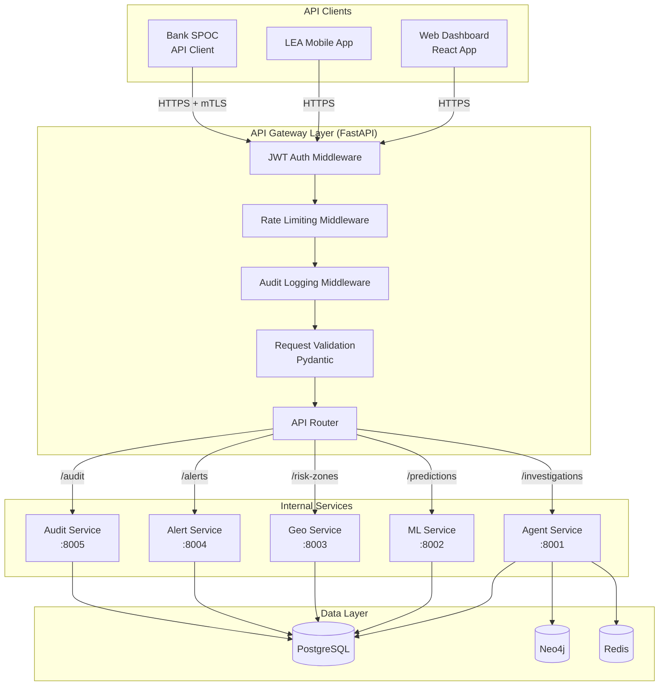
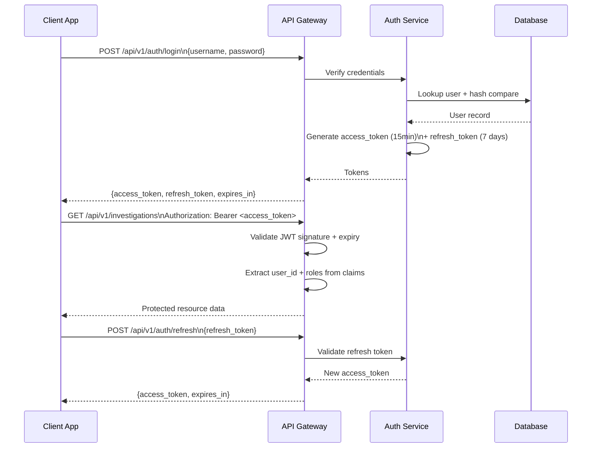
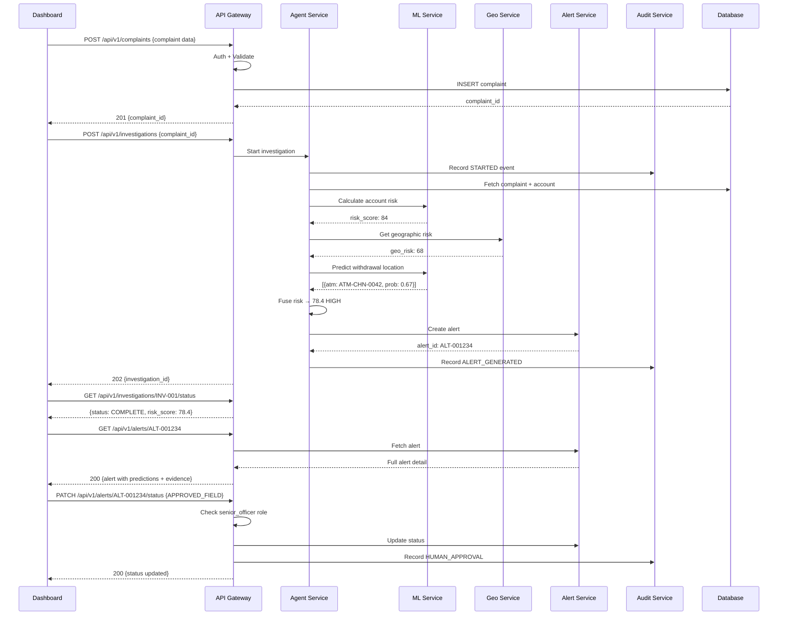

# REA API System Design

> **PCCWIS — Complete API Architecture and Endpoint Reference**
> Predictive Cybercrime Cash Withdrawal Intelligence System

---

## Table of Contents

1. [API Architecture Overview](#1-api-architecture-overview)
2. [REST API Design Principles](#2-rest-api-design-principles)
3. [Authentication](#3-authentication)
4. [Authorization and RBAC](#4-authorization-and-rbac)
5. [Request Validation](#5-request-validation)
6. [Error Format](#6-error-format)
7. [Rate Limiting](#7-rate-limiting)
8. [Audit Logging](#8-audit-logging)
9. [API Versioning](#9-api-versioning)
10. [Endpoint Reference](#10-endpoint-reference)
    - [Authentication Endpoints](#101-authentication-endpoints)
    - [Complaint Endpoints](#102-complaint-endpoints)
    - [Investigation Endpoints](#103-investigation-endpoints)
    - [Account Endpoints](#104-account-endpoints)
    - [Prediction Endpoints](#105-prediction-endpoints)
    - [Geospatial Endpoints](#106-geospatial-endpoints)
    - [Alert Endpoints](#107-alert-endpoints)
    - [Report Endpoints](#108-report-endpoints)
    - [Audit Endpoints](#109-audit-endpoints)
11. [Internal Service APIs](#11-internal-service-apis)
12. [API Sequence Diagrams](#12-api-sequence-diagrams)
13. [Security Considerations](#13-security-considerations)

---

## 1. API Architecture Overview



---

## 2. REST API Design Principles

| Principle | Implementation |
|---|---|
| **Versioning** | URL path versioning: `/api/v1/` |
| **Resource naming** | Plural nouns: `/complaints`, `/investigations`, `/alerts` |
| **HTTP verbs** | GET (read), POST (create), PATCH (partial update), DELETE (remove) |
| **Status codes** | Standard HTTP (200, 201, 400, 401, 403, 404, 422, 429, 500) |
| **Pagination** | Cursor-based: `?cursor=<token>&limit=20` |
| **Filtering** | Query params: `?status=active&severity=HIGH` |
| **Sorting** | `?sort=created_at&order=desc` |
| **Content type** | `application/json` always |
| **Response envelope** | `{data, meta, errors}` structure |

### Standard Response Envelope

```json
{
  "data": { ... },      // The actual response payload
  "meta": {
    "request_id": "req-abc123",
    "timestamp": "2024-01-15T12:30:00Z",
    "version": "v1"
  },
  "errors": null        // null on success, error array on failure
}
```

---

## 3. Authentication

### 3.1 JWT Authentication Flow



### 3.2 JWT Claims Structure

```json
{
  "sub": "user-uuid-here",
  "iat": 1705308600,
  "exp": 1705309500,
  "roles": ["investigator"],
  "org": "I4C",
  "jti": "unique-token-id"
}
```

---

## 4. Authorization and RBAC

### 4.1 Role Definitions

| Role | Code | Description |
|---|---|---|
| Analyst | `analyst` | Read-only access to investigations and complaints |
| Investigator | `investigator` | Create investigations, approve MEDIUM alerts |
| Senior Officer | `senior_officer` | Approve CRITICAL/EXTREME alerts, request freezes |
| Administrator | `admin` | User management, model configuration |
| Bank SPOC | `bank_spoc` | Receive freeze requests, acknowledge alerts |
| LEA Officer | `lea_officer` | Receive field alerts, record outcomes |

### 4.2 Permission Matrix

| Endpoint | analyst | investigator | senior_officer | admin | bank_spoc | lea_officer |
|---|:---:|:---:|:---:|:---:|:---:|:---:|
| GET /complaints | ✅ | ✅ | ✅ | ✅ | ❌ | ❌ |
| POST /complaints | ❌ | ✅ | ✅ | ✅ | ❌ | ❌ |
| POST /investigations | ❌ | ✅ | ✅ | ✅ | ❌ | ❌ |
| GET /investigations | ✅ | ✅ | ✅ | ✅ | ❌ | ❌ |
| GET /accounts/:id | ✅ | ✅ | ✅ | ✅ | ❌ | ❌ |
| GET /predictions | ✅ | ✅ | ✅ | ✅ | ❌ | ❌ |
| GET /risk-zones | ✅ | ✅ | ✅ | ✅ | ❌ | ✅ |
| GET /alerts | ✅ | ✅ | ✅ | ✅ | ✅ | ✅ |
| PATCH /alerts/:id/status (MEDIUM) | ❌ | ✅ | ✅ | ✅ | ❌ | ❌ |
| PATCH /alerts/:id/status (CRITICAL) | ❌ | ❌ | ✅ | ✅ | ❌ | ❌ |
| GET /audit | ❌ | ✅ | ✅ | ✅ | ❌ | ❌ |

---

## 5. Request Validation

All request bodies are validated using **Pydantic v2** before reaching service logic:

```python
from pydantic import BaseModel, Field, validator
from typing import Literal, Optional

class CreateInvestigationRequest(BaseModel):
    complaint_id: str = Field(..., pattern=r"^CMP-[0-9]{4}-[0-9]{6}$")
    priority: Literal["LOW", "MEDIUM", "HIGH", "CRITICAL"] = "MEDIUM"
    max_graph_depth: int = Field(default=5, ge=1, le=5)
    max_tool_calls: int = Field(default=100, ge=10, le=100)
    assigned_to: Optional[str] = None

    @validator("complaint_id")
    def complaint_must_exist(cls, v):
        # Additional business logic validation
        return v
```

**Validation error response (422):**
```json
{
  "data": null,
  "meta": { "request_id": "req-xyz", "timestamp": "...", "version": "v1" },
  "errors": [
    {
      "code": "VALIDATION_ERROR",
      "field": "complaint_id",
      "message": "String should match pattern '^CMP-[0-9]{4}-[0-9]{6}$'",
      "location": "body"
    }
  ]
}
```

---

## 6. Error Format

All errors follow the same structure:

```json
{
  "data": null,
  "meta": {
    "request_id": "req-abc123",
    "timestamp": "2024-01-15T12:30:00Z",
    "version": "v1"
  },
  "errors": [
    {
      "code": "RESOURCE_NOT_FOUND",
      "message": "Investigation INV-001 not found",
      "field": null,
      "documentation_url": "https://api.pccwis.internal/docs/errors/RESOURCE_NOT_FOUND"
    }
  ]
}
```

### Standard Error Codes

| HTTP Status | Error Code | Description |
|---|---|---|
| 400 | `BAD_REQUEST` | Malformed request |
| 401 | `UNAUTHORIZED` | Missing or invalid JWT |
| 403 | `FORBIDDEN` | Valid JWT but insufficient role |
| 404 | `RESOURCE_NOT_FOUND` | Entity does not exist |
| 409 | `CONFLICT` | Duplicate resource |
| 422 | `VALIDATION_ERROR` | Request body validation failed |
| 429 | `RATE_LIMIT_EXCEEDED` | Too many requests |
| 500 | `INTERNAL_ERROR` | Server error (opaque, logged internally) |
| 503 | `SERVICE_UNAVAILABLE` | Upstream service down |

---

## 7. Rate Limiting

Rate limits are enforced per user per endpoint:

| Role | Default Limit | Investigation Endpoints |
|---|---|---|
| `analyst` | 100 req/min | 10/min |
| `investigator` | 200 req/min | 30/min |
| `senior_officer` | 300 req/min | 50/min |
| `admin` | 500 req/min | 100/min |
| `bank_spoc` | 50 req/min | N/A |
| `lea_officer` | 50 req/min | N/A |

**Rate limit response headers:**
```
X-RateLimit-Limit: 100
X-RateLimit-Remaining: 47
X-RateLimit-Reset: 1705308660
```

---

## 8. Audit Logging

Every API request is logged with:

```json
{
  "log_type": "API_REQUEST",
  "timestamp": "2024-01-15T12:30:00Z",
  "request_id": "req-abc123",
  "user_id": "user-uuid",
  "user_role": "investigator",
  "method": "POST",
  "path": "/api/v1/investigations",
  "status_code": 201,
  "duration_ms": 234,
  "ip_address": "10.0.0.xx",   // masked in logs
  "user_agent": "PCCWIS-Dashboard/1.0"
}
```

Sensitive payloads (account numbers, PII) are masked in logs.

---

## 9. API Versioning

- Current version: **v1**
- Version in URL path: `/api/v1/`
- Deprecation notice: minimum 90 days via `Deprecation` response header
- Version negotiation: `Accept: application/vnd.pccwis.v1+json`

---

## 10. Endpoint Reference

### 10.1 Authentication Endpoints

---

#### `POST /api/v1/auth/login`

**Purpose:** Authenticate a user and issue JWT tokens.

**Authentication:** None (public endpoint)

**Authorization:** None

**Request:**
```json
{
  "username": "officer.raj@i4c.gov.in",
  "password": "SecurePassword123!"
}
```

**Response (200):**
```json
{
  "data": {
    "access_token": "eyJhbGciOiJIUzI1NiIs...",
    "refresh_token": "eyJhbGciOiJIUzI1NiIs...",
    "token_type": "Bearer",
    "expires_in": 900,
    "user": {
      "user_id": "user-uuid",
      "name": "Raj Kumar",
      "role": "investigator",
      "org": "I4C"
    }
  },
  "meta": { "request_id": "req-001", "timestamp": "...", "version": "v1" },
  "errors": null
}
```

**Status Codes:**
- `200` — Success
- `401` — Invalid credentials
- `429` — Rate limit (login attempts)

---

#### `POST /api/v1/auth/refresh`

**Purpose:** Refresh an expired access token using refresh token.

**Authentication:** None

**Request:**
```json
{
  "refresh_token": "eyJhbGciOiJIUzI1NiIs..."
}
```

**Response (200):**
```json
{
  "data": {
    "access_token": "eyJhbGciOiJIUzI1NiIs...",
    "expires_in": 900
  },
  "meta": { ... },
  "errors": null
}
```

**Status Codes:**
- `200` — Success
- `401` — Refresh token expired or invalid
- `429` — Rate limit

---

### 10.2 Complaint Endpoints

---

#### `POST /api/v1/complaints`

**Purpose:** Register a new cybercrime complaint.

**Authentication:** Required (JWT)

**Authorization:** `investigator`, `senior_officer`, `admin`

**Request:**
```json
{
  "victim_account_id": "ACC-SYN-001",
  "fraud_amount": 80000,
  "complaint_type": "UPI_FRAUD",
  "district": "Chennai",
  "pincode": "600001",
  "description": "Victim transferred money after receiving fake KYC call",
  "reported_by": "victim_self"
}
```

**Response (201):**
```json
{
  "data": {
    "complaint_id": "CMP-2024-987654",
    "complaint_no": "NCRP-2024-CHN-987654",
    "status": "REGISTERED",
    "created_at": "2024-01-15T12:15:00Z"
  },
  "meta": { ... },
  "errors": null
}
```

**Validation:**
- `fraud_amount`: must be > 0 and ≤ 10,000,000
- `complaint_type`: must be from allowed enum
- `pincode`: must be 6-digit numeric string

**Status Codes:**
- `201` — Created
- `400` — Bad request
- `422` — Validation error
- `409` — Duplicate complaint (same victim+amount+time)

---

#### `GET /api/v1/complaints/:id`

**Purpose:** Retrieve a specific complaint by ID.

**Authentication:** Required (JWT)

**Authorization:** `analyst`, `investigator`, `senior_officer`, `admin`

**Response (200):**
```json
{
  "data": {
    "complaint_id": "CMP-2024-987654",
    "complaint_no": "NCRP-2024-CHN-987654",
    "reported_at": "2024-01-15T12:15:00Z",
    "victim_account_id": "ACC-SYN-001",
    "fraud_amount": 80000,
    "complaint_type": "UPI_FRAUD",
    "district": "Chennai",
    "status": "UNDER_INVESTIGATION",
    "investigation_id": "INV-2024-001"
  },
  "meta": { ... },
  "errors": null
}
```

**Status Codes:**
- `200` — Success
- `404` — Complaint not found

---

#### `GET /api/v1/complaints`

**Purpose:** List complaints with filtering and pagination.

**Authentication:** Required (JWT)

**Authorization:** `analyst`, `investigator`, `senior_officer`, `admin`

**Query Parameters:**
- `status` — `REGISTERED` | `UNDER_INVESTIGATION` | `CLOSED`
- `district` — District name filter
- `from_date` — ISO 8601 date
- `to_date` — ISO 8601 date
- `complaint_type` — Complaint category
- `cursor` — Pagination cursor
- `limit` — Max 100, default 20

**Response (200):**
```json
{
  "data": {
    "complaints": [ { ... }, { ... } ],
    "total": 1243,
    "cursor_next": "cursor-token-abc",
    "has_more": true
  },
  "meta": { ... },
  "errors": null
}
```

---

### 10.3 Investigation Endpoints

---

#### `POST /api/v1/investigations`

**Purpose:** Start a new investigation for a complaint.

**Authentication:** Required (JWT)

**Authorization:** `investigator`, `senior_officer`, `admin`

**Request:**
```json
{
  "complaint_id": "CMP-2024-987654",
  "priority": "HIGH",
  "max_graph_depth": 5,
  "max_tool_calls": 100,
  "notes": "Flagged for immediate investigation due to large amount"
}
```

**Response (202 Accepted — async):**
```json
{
  "data": {
    "investigation_id": "INV-2024-001",
    "complaint_id": "CMP-2024-987654",
    "status": "STARTED",
    "agent_run_id": "AGENT-RUN-xyz",
    "estimated_completion_minutes": 15,
    "created_at": "2024-01-15T12:16:00Z"
  },
  "meta": { ... },
  "errors": null
}
```

**Notes:**
- Investigation is asynchronous — use GET /investigations/:id/status to poll
- Response is 202 (Accepted) because investigation takes time

**Status Codes:**
- `202` — Investigation started
- `404` — Complaint not found
- `409` — Investigation already exists for this complaint
- `422` — Validation error

---

#### `GET /api/v1/investigations/:id`

**Purpose:** Retrieve full investigation details.

**Authentication:** Required (JWT)

**Authorization:** `analyst`, `investigator`, `senior_officer`, `admin`

**Response (200):**
```json
{
  "data": {
    "investigation_id": "INV-2024-001",
    "complaint_id": "CMP-2024-987654",
    "status": "COMPLETE",
    "started_at": "2024-01-15T12:16:00Z",
    "completed_at": "2024-01-15T12:30:00Z",
    "tool_calls_made": 18,
    "graph_depth_reached": 2,
    "accounts_investigated": 3,
    "flags_raised": ["FAN_OUT", "RAPID_TRANSIT"],
    "fused_risk_score": 78.4,
    "risk_level": "HIGH",
    "withdrawal_prediction": {
      "top_atm": { "atm_id": "ATM-CHN-0042", "probability": 0.67 },
      "predicted_window": "14:00 - 16:00 IST"
    },
    "alert_id": "ALT-2024-001234",
    "report_id": "RPT-2024-001"
  },
  "meta": { ... },
  "errors": null
}
```

---

#### `GET /api/v1/investigations/:id/status`

**Purpose:** Lightweight status check for polling during investigation.

**Authentication:** Required (JWT)

**Authorization:** `analyst`, `investigator`, `senior_officer`, `admin`

**Response (200):**
```json
{
  "data": {
    "investigation_id": "INV-2024-001",
    "status": "IN_PROGRESS",
    "tool_calls_made": 7,
    "current_step": "TRACE_TRANSACTIONS",
    "progress_pct": 35,
    "estimated_remaining_minutes": 8
  },
  "meta": { ... },
  "errors": null
}
```

**Poll recommendation:** Every 10 seconds, stop polling when `status` is `COMPLETE`, `FAILED`, or `ABORTED`.

---

#### `GET /api/v1/investigations/:id/graph`

**Purpose:** Retrieve the transaction graph data for visualization.

**Authentication:** Required (JWT)

**Authorization:** `analyst`, `investigator`, `senior_officer`, `admin`

**Response (200):**
```json
{
  "data": {
    "investigation_id": "INV-2024-001",
    "nodes": [
      { "id": "V001", "type": "victim", "label": "Victim Account", "risk_score": null },
      { "id": "M001", "type": "suspect", "label": "Mule Account", "risk_score": 71 },
      { "id": "M002", "type": "suspect", "label": "Mule Account", "risk_score": 84 }
    ],
    "edges": [
      { "from": "V001", "to": "M001", "amount": 80000, "timestamp": "...", "flags": [] },
      { "from": "M001", "to": "M002", "amount": 40000, "timestamp": "...", "flags": ["RAPID_TRANSIT"] }
    ],
    "suspicious_paths": [
      { "path": ["V001", "M001", "M002"], "flags": ["FAN_OUT", "RAPID_TRANSIT"] }
    ]
  },
  "meta": { ... },
  "errors": null
}
```

---

#### `GET /api/v1/investigations/:id/events`

**Purpose:** Get the timeline of investigation events (tool calls, decisions, etc.).

**Authentication:** Required (JWT)

**Authorization:** `analyst`, `investigator`, `senior_officer`, `admin`

**Response (200):**
```json
{
  "data": {
    "investigation_id": "INV-2024-001",
    "events": [
      {
        "event_id": "EVT-001",
        "timestamp": "2024-01-15T12:16:05Z",
        "event_type": "TOOL_CALLED",
        "tool_name": "get_complaint",
        "status": "SUCCESS",
        "duration_ms": 45
      },
      {
        "event_id": "EVT-002",
        "timestamp": "2024-01-15T12:16:08Z",
        "event_type": "TOOL_CALLED",
        "tool_name": "get_account",
        "status": "SUCCESS",
        "duration_ms": 32
      }
    ]
  },
  "meta": { ... },
  "errors": null
}
```

---

### 10.4 Account Endpoints

---

#### `GET /api/v1/accounts/:id`

**Purpose:** Retrieve account profile.

**Authentication:** Required (JWT)

**Authorization:** `analyst`, `investigator`, `senior_officer`, `admin`

**Response (200):**
```json
{
  "data": {
    "account_id": "ACC-SYN-M001",
    "bank": "SBI",
    "account_type": "savings",
    "opened_at": "2023-06-15T00:00:00Z",
    "kyc_score": 45,
    "is_mule_suspect": true,
    "last_activity": "2024-01-15T12:18:00Z",
    "current_risk_score": 84
  },
  "meta": { ... },
  "errors": null
}
```

**Note:** Raw account number is masked. Only the internal account ID is returned.

---

#### `GET /api/v1/accounts/:id/transactions`

**Purpose:** Retrieve transactions for an account.

**Authentication:** Required (JWT)

**Authorization:** `investigator`, `senior_officer`, `admin`

**Query Parameters:**
- `direction` — `incoming` | `outgoing` | `all`
- `from_date`, `to_date`
- `limit` — Max 200
- `cursor` — Pagination

**Response (200):**
```json
{
  "data": {
    "account_id": "ACC-SYN-M001",
    "transactions": [
      {
        "transaction_id": "TXN-001",
        "from_account": "ACC-SYN-V001",
        "to_account": "ACC-SYN-M001",
        "amount": 80000,
        "channel": "NEFT",
        "timestamp": "2024-01-15T12:16:00Z",
        "flags": ["LARGE_TRANSFER"]
      }
    ],
    "total": 1,
    "flags": ["RAPID_TRANSIT"]
  },
  "meta": { ... },
  "errors": null
}
```

---

#### `GET /api/v1/accounts/:id/relationships`

**Purpose:** Get accounts linked to the target account.

**Authentication:** Required (JWT)

**Authorization:** `investigator`, `senior_officer`, `admin`

**Response (200):**
```json
{
  "data": {
    "account_id": "ACC-SYN-M001",
    "related_accounts": [
      {
        "account_id": "ACC-SYN-M004",
        "relationship_type": "shared_phone",
        "strength": 0.95
      }
    ]
  },
  "meta": { ... },
  "errors": null
}
```

---

#### `GET /api/v1/accounts/:id/risk`

**Purpose:** Get ML-computed risk assessment for an account.

**Authentication:** Required (JWT)

**Authorization:** `investigator`, `senior_officer`, `admin`

**Response (200):**
```json
{
  "data": {
    "account_id": "ACC-SYN-M001",
    "risk_score": 84.2,
    "risk_level": "HIGH",
    "model_version": "account_risk_v2.1",
    "assessed_at": "2024-01-15T12:22:00Z",
    "top_risk_factors": [
      { "feature": "transaction_velocity_1h", "shap_value": 12.4 },
      { "feature": "kyc_score", "shap_value": 8.1 },
      { "feature": "fan_out_degree", "shap_value": 7.6 }
    ],
    "explanation": "Account shows high transaction velocity and low KYC compliance consistent with mule account patterns"
  },
  "meta": { ... },
  "errors": null
}
```

---

### 10.5 Prediction Endpoints

---

#### `POST /api/v1/predictions/withdrawal`

**Purpose:** Trigger a withdrawal location prediction for given accounts.

**Authentication:** Required (JWT)

**Authorization:** `investigator`, `senior_officer`, `admin`

**Request:**
```json
{
  "investigation_id": "INV-2024-001",
  "account_ids": ["ACC-SYN-M001", "ACC-SYN-M002"],
  "complaint_district": "Chennai",
  "fraud_timestamp": "2024-01-15T12:15:00Z"
}
```

**Response (200):**
```json
{
  "data": {
    "prediction_id": "PRED-2024-001",
    "investigation_id": "INV-2024-001",
    "predictions": [
      {
        "rank": 1,
        "atm_id": "ATM-CHN-0042",
        "location": { "lat": 13.0827, "lon": 80.2707 },
        "district": "Chennai North",
        "probability": 0.67,
        "cluster_id": "CLUSTER-CHN-NORTH"
      },
      {
        "rank": 2,
        "atm_id": "ATM-CHN-0017",
        "location": { "lat": 13.0706, "lon": 80.2594 },
        "district": "Chennai Central",
        "probability": 0.21,
        "cluster_id": "CLUSTER-CHN-CENTRAL"
      }
    ],
    "predicted_window": {
      "start": "2024-01-15T14:00:00Z",
      "end": "2024-01-15T16:00:00Z"
    },
    "model_version": "withdrawal_loc_v1.4",
    "confidence": 0.82,
    "created_at": "2024-01-15T12:25:00Z",
    "disclaimer": "Probabilistic prediction — not a certainty. Requires human verification."
  },
  "meta": { ... },
  "errors": null
}
```

---

#### `GET /api/v1/predictions/:id`

**Purpose:** Retrieve a prediction by ID.

**Authentication:** Required (JWT)

**Authorization:** `analyst`, `investigator`, `senior_officer`, `admin`

**Response:** Same structure as POST response above, plus outcome if available.

---

### 10.6 Geospatial Endpoints

---

#### `GET /api/v1/risk-zones`

**Purpose:** Retrieve geographic risk zones for map visualization.

**Authentication:** Required (JWT)

**Authorization:** All authenticated roles

**Query Parameters:**
- `state` — State name filter
- `district` — District filter
- `min_risk_score` — Minimum risk score filter (default: 40)
- `format` — `geojson` | `json` (default: `json`)

**Response (200 — GeoJSON format):**
```json
{
  "data": {
    "type": "FeatureCollection",
    "features": [
      {
        "type": "Feature",
        "geometry": {
          "type": "Polygon",
          "coordinates": [ [...lat/lon pairs...] ]
        },
        "properties": {
          "zone_id": "ZONE-CHN-N01",
          "district": "Chennai North",
          "state": "Tamil Nadu",
          "risk_score": 82.1,
          "risk_level": "HIGH",
          "crime_count_30d": 47,
          "hotspot_atms": ["ATM-CHN-0042", "ATM-CHN-0017"]
        }
      }
    ]
  },
  "meta": { ... },
  "errors": null
}
```

---

#### `GET /api/v1/atms`

**Purpose:** Retrieve ATM list with risk scores.

**Authentication:** Required (JWT)

**Authorization:** `analyst`, `investigator`, `senior_officer`, `admin`, `lea_officer`

**Query Parameters:**
- `lat`, `lon`, `radius_km` — Location-based filter
- `min_risk_score` — Minimum risk filter
- `district` — District filter
- `limit` — Max 200

**Response (200):**
```json
{
  "data": {
    "atms": [
      {
        "atm_id": "ATM-CHN-0042",
        "bank": "SBI",
        "location": { "lat": 13.0827, "lon": 80.2707 },
        "district": "Chennai North",
        "risk_score": 74.1,
        "risk_level": "HIGH",
        "fraud_incidents_90d": 12,
        "status": "ACTIVE"
      }
    ],
    "total": 1
  },
  "meta": { ... },
  "errors": null
}
```

---

#### `GET /api/v1/atms/:id/risk`

**Purpose:** Get risk details for a specific ATM.

**Authentication:** Required (JWT)

**Authorization:** `analyst`, `investigator`, `senior_officer`, `admin`

**Response (200):**
```json
{
  "data": {
    "atm_id": "ATM-CHN-0042",
    "risk_score": 74.1,
    "risk_level": "HIGH",
    "fraud_incident_count_90d": 12,
    "last_incident": "2024-01-10T15:30:00Z",
    "time_pattern": "Peak risk: 14:00-18:00 IST",
    "associated_complaints": 8,
    "cluster_id": "CLUSTER-CHN-NORTH"
  },
  "meta": { ... },
  "errors": null
}
```

---

### 10.7 Alert Endpoints

---

#### `POST /api/v1/alerts`

**Purpose:** Manually create an alert (typically called internally by agent service).

**Authentication:** Required (JWT)

**Authorization:** `senior_officer`, `admin` (agent service uses service token)

**Request:**
```json
{
  "investigation_id": "INV-2024-001",
  "severity": "HIGH",
  "risk_score": 78.4,
  "predicted_atm_ids": ["ATM-CHN-0042", "ATM-CHN-0017"],
  "predicted_window_start": "2024-01-15T14:00:00Z",
  "predicted_window_end": "2024-01-15T16:00:00Z",
  "evidence_summary": "Multi-hop mule account network detected...",
  "human_approved": false,
  "confidence": 0.82
}
```

**Response (201):**
```json
{
  "data": {
    "alert_id": "ALT-2024-001234",
    "status": "ACTIVE",
    "dispatched_to": ["LEA_DASHBOARD", "I4C_COMMAND"],
    "created_at": "2024-01-15T12:29:00Z"
  },
  "meta": { ... },
  "errors": null
}
```

---

#### `GET /api/v1/alerts`

**Purpose:** List alerts with filtering.

**Authentication:** Required (JWT)

**Authorization:** All roles (bank_spoc and lea_officer see only their relevant alerts)

**Query Parameters:**
- `severity` — `LOW` | `MEDIUM` | `HIGH` | `CRITICAL` | `EXTREME`
- `status` — `ACTIVE` | `ACKNOWLEDGED` | `RESOLVED` | `FALSE_POSITIVE`
- `from_date`, `to_date`
- `district` — Geographic filter
- `cursor`, `limit`

**Response (200):**
```json
{
  "data": {
    "alerts": [
      {
        "alert_id": "ALT-2024-001234",
        "complaint_id": "CMP-2024-987654",
        "investigation_id": "INV-2024-001",
        "severity": "HIGH",
        "risk_score": 78.4,
        "status": "ACTIVE",
        "top_predicted_location": {
          "district": "Chennai North",
          "atm_id": "ATM-CHN-0042"
        },
        "created_at": "2024-01-15T12:29:00Z"
      }
    ],
    "total": 47,
    "cursor_next": "..."
  },
  "meta": { ... },
  "errors": null
}
```

---

#### `GET /api/v1/alerts/:id`

**Purpose:** Get full alert details including evidence and predictions.

**Authentication:** Required (JWT)

**Authorization:** `analyst`, `investigator`, `senior_officer`, `admin`, `lea_officer`

**Response (200):**
```json
{
  "data": {
    "alert_id": "ALT-2024-001234",
    "severity": "HIGH",
    "risk_score": 78.4,
    "confidence": 0.82,
    "status": "ACTIVE",
    "predicted_locations": [
      {
        "rank": 1,
        "atm_id": "ATM-CHN-0042",
        "location": { "lat": 13.0827, "lon": 80.2707 },
        "district": "Chennai North",
        "probability": 0.67,
        "predicted_window": "14:00-16:00 IST"
      }
    ],
    "evidence_chain": [
      "₹80,000 fraud reported at 12:15",
      "Victim V001 → Mule M001 (₹80,000) at 12:16 — RAPID_TRANSIT",
      "M001 fan-out → M002 (₹40k), M003 (₹40k) at 12:18",
      "M002 risk score: 84/100 (HIGH)",
      "M002 historical withdrawals: Chennai North (67% of history)"
    ],
    "model_contributions": {
      "fraud_classifier": 0.25,
      "anomaly_detector": 0.20,
      "account_risk": 0.21,
      "graph_score": 0.15,
      "geographic_risk": 0.12,
      "temporal": 0.07
    },
    "disclaimer": "Probabilistic prediction — requires human verification before field deployment",
    "audit_hash": "sha256:abc123def456...",
    "created_at": "2024-01-15T12:29:00Z"
  },
  "meta": { ... },
  "errors": null
}
```

---

#### `PATCH /api/v1/alerts/:id/status`

**Purpose:** Update alert status (acknowledge, resolve, mark false positive, approve for field).

**Authentication:** Required (JWT)

**Authorization:**
- `ACKNOWLEDGED` → `investigator`, `senior_officer`
- `APPROVED_FIELD` → `senior_officer`, `admin`
- `RESOLVED` → `investigator`, `senior_officer`
- `FALSE_POSITIVE` → `senior_officer`, `admin`

**Request:**
```json
{
  "status": "APPROVED_FIELD",
  "notes": "Evidence chain is coherent. Deploying unit to Chennai North.",
  "officer_id": "OFF-042"
}
```

**Response (200):**
```json
{
  "data": {
    "alert_id": "ALT-2024-001234",
    "previous_status": "ACTIVE",
    "new_status": "APPROVED_FIELD",
    "updated_by": "OFF-042",
    "updated_at": "2024-01-15T12:31:00Z"
  },
  "meta": { ... },
  "errors": null
}
```

**Status Codes:**
- `200` — Updated
- `403` — Insufficient role for this status transition
- `404` — Alert not found
- `409` — Invalid status transition

---

### 10.8 Report Endpoints

---

#### `POST /api/v1/reports`

**Purpose:** Generate an intelligence report for an investigation.

**Authentication:** Required (JWT)

**Authorization:** `investigator`, `senior_officer`, `admin`

**Request:**
```json
{
  "investigation_id": "INV-2024-001",
  "report_type": "INTELLIGENCE_BRIEF",
  "include_graph": true,
  "include_explanation": true
}
```

**Response (202):**
```json
{
  "data": {
    "report_id": "RPT-2024-001",
    "status": "GENERATING",
    "estimated_seconds": 30
  },
  "meta": { ... },
  "errors": null
}
```

---

#### `GET /api/v1/reports/:id`

**Purpose:** Retrieve a generated report.

**Authentication:** Required (JWT)

**Authorization:** `analyst`, `investigator`, `senior_officer`, `admin`

**Response (200):**
```json
{
  "data": {
    "report_id": "RPT-2024-001",
    "investigation_id": "INV-2024-001",
    "status": "COMPLETE",
    "report_type": "INTELLIGENCE_BRIEF",
    "summary": "A ₹80,000 UPI fraud complaint has been investigated. A multi-hop mule account network was identified...",
    "evidence_chain": [...],
    "risk_assessment": "HIGH risk (score: 78.4). Withdrawal predicted at Chennai North ATM cluster.",
    "recommended_action": "Deploy field unit to Chennai North ATM cluster within 90 minutes.",
    "confidence_note": "This is a probabilistic prediction based on historical behavioral patterns. Confidence: 82%. Human verification required before field action.",
    "generated_at": "2024-01-15T12:32:00Z",
    "audit_hash": "sha256:def789..."
  },
  "meta": { ... },
  "errors": null
}
```

---

### 10.9 Audit Endpoints

---

#### `GET /api/v1/audit/:investigation_id`

**Purpose:** Retrieve the complete tamper-evident audit trail for an investigation.

**Authentication:** Required (JWT)

**Authorization:** `investigator`, `senior_officer`, `admin`

**Response (200):**
```json
{
  "data": {
    "investigation_id": "INV-2024-001",
    "chain_head_hash": "sha256:xyz789...",
    "chain_valid": true,
    "events": [
      {
        "event_id": "AUD-001",
        "event_type": "INVESTIGATION_STARTED",
        "event_hash": "sha256:aaa...",
        "previous_hash": "sha256:genesis...",
        "chain_hash": "sha256:bbb...",
        "timestamp": "2024-01-15T12:16:00Z",
        "metadata": {
          "complaint_id": "CMP-2024-987654",
          "agent_run_id": "AGENT-RUN-xyz"
        }
      },
      {
        "event_id": "AUD-002",
        "event_type": "TOOL_CALLED",
        "event_hash": "sha256:ccc...",
        "previous_hash": "sha256:bbb...",
        "chain_hash": "sha256:ddd...",
        "timestamp": "2024-01-15T12:16:05Z",
        "metadata": {
          "tool_name": "get_complaint",
          "input_hash": "sha256:...",
          "output_hash": "sha256:..."
        }
      }
    ]
  },
  "meta": { ... },
  "errors": null
}
```

---

## 11. Internal Service APIs

### 11.1 Frontend → API Gateway

All requests use HTTPS + JWT Bearer token. Rate limited per user.

### 11.2 API Gateway → Agent Service

```
POST http://agent-service:8001/api/internal/investigations/start
Authorization: Bearer <service-token>
{
  "complaint_id": "...",
  "investigation_id": "...",
  "config": {...}
}
```

### 11.3 Agent → ML Service

```
POST http://ml-service:8002/api/ml/account-risk
POST http://ml-service:8002/api/ml/fraud-classify
POST http://ml-service:8002/api/ml/anomaly-detect
POST http://ml-service:8002/api/ml/withdrawal-location
```

All internal APIs use service-to-service tokens (short-lived, not user JWTs).

### 11.4 Agent → Graph Service

```
POST http://graph-service:8003/api/graph/traverse
POST http://graph-service:8003/api/graph/account-neighbors
GET  http://graph-service:8003/api/graph/account/:id
```

Uses Bolt protocol directly for Neo4j, or REST wrapper.

### 11.5 Agent → Audit Service

```
POST http://audit-service:8005/api/audit/events
GET  http://audit-service:8005/api/audit/chain/:investigation_id
```

Audit service is append-only. No DELETE or PATCH operations.

### 11.6 Backend → Database

All database access is parameterized queries (no raw string interpolation). Connection pooling via SQLAlchemy async.

### 11.7 Backend → Blockchain/Audit Layer

```python
# Audit chain record pattern
event_content = json.dumps({
    "investigation_id": investigation_id,
    "event_type": event_type,
    "data_hash": sha256(event_data),
    "timestamp": timestamp
}, sort_keys=True)

event_hash = sha256(event_content + previous_hash)
```

---

## 12. API Sequence Diagrams

### End-to-End: Complaint → Alert



---

## 13. Security Considerations

### 13.1 API Security Checklist

- [x] TLS 1.3 on all endpoints (internal + external)
- [x] JWT token validation on every protected endpoint
- [x] RBAC checked for every operation
- [x] Input validation with Pydantic (no raw SQL)
- [x] Rate limiting per user per endpoint
- [x] CORS restricted to whitelisted origins
- [x] No sensitive data in URL query parameters
- [x] Account numbers masked in API responses
- [x] PII not logged in structured logs
- [x] Service-to-service tokens separate from user tokens
- [x] Audit log for every API request

### 13.2 Sensitive Operations

Operations with elevated security requirements:

| Operation | Control |
|---|---|
| Account freeze request | Dual-approval (officer + bank SPOC) |
| Field deployment trigger | Senior officer + audit log |
| Audit trail access | Only investigators and above |
| ML model config change | Admin only + change log |
| User role change | Admin only + dual-approval |

---

*Document version: 1.0 | PCCWIS — Problem Statement ID 26184*
